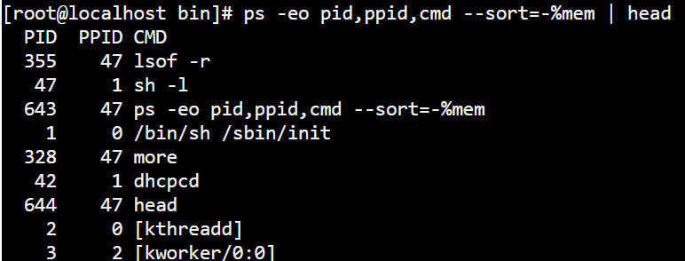

## Linux指令基础

### 1，使用命令帮助

#### 1.1，whatis 简要说明命令的作用

```shell
#模板：

whatis command

#示例：查看cat指令的作用

whatis cat
```

#### 1.2，info 更详细的说明文档

```shell
#模板

info command

#示例：就会看到更加详细的说明

info cat
```

#### 1.3，man 查询命令command的说明文档

###### a).在man的帮助手册中，帮助文档被分成了9个类别

> (1)、用户可以操作的命令或者是可执行文件  
> (2)、系统核心可调用的函数与工具等  
> (3)、一些常用的函数与数据库  
> (4)、设备文件的说明  
> (5)、设置文件或者某些文件的格式  
> (6)、游戏  
> (7)、惯例与协议等。例如Linux标准文件系统、网络协议、ASCⅡ码等说明内容  
> (8)、系统管理员可用的管理条令  
> (9)、与内核有关的文件

```shell
#模板

man command

#示例：man date
```

```shell
#当我们使用whatis printf的时候发现，在1分类和3分类都有，当我们要查看指定分类3中的帮助

man -k keyword

#示例：

man 3 printf
```

```shell
#查询关键字 根据命令中部分关键字来查询命令，适用于只记住部分命令的场合

#示例：查找GNOME的config配置工具命令中包含"1"的指令（1也可以换成cat）

man -k GNOME config | grep 1
```

#### 1.4，which 查看路径

```shell
#模板

which command

#示例：
which make
install >/opt/app/openav/soft/bin/make

```

```shell
#查看程序的搜索路径：当一个系统中安装了同一个软件的多个版本，不确定使用的是哪个版本，就可以使用这个命令；

whereis command
```

### 2，文件及目录管理

#### 2.1，删除和创建

```shell
#创建文件夹：mkdir

#创建文件：touch

#删除：rm

#删除非空目录：rm -rf file目录

#删除日志：rm *log (等价于：find ./ -name "*log" -exec rm {}\;) #删除以log结尾的文件

#移动：mv

#复制：cp 

#复制目录：cp -r source_dir dest_dir     目录有多层，所以需要加上-r表示递归

#查看当前目录下的文件个数：find ./ | wc -l
```

#### 2.2，目录切换

```shell
#找到文件/目录位置：cd

#切换当上一个工作目录：cd - or cd ..

#切换到home目录：cd or cd ~

#显示当前目录：pwd

#更改当前工作路径为path：cd path  (path=/home/test)
```

#### 2.3，列出目录项

```shell
#显示当前目录下的文件：ls

#按时间排序以列表的方式显示目录项：ls -lrt
#    l：以长格式显示文件信息，包括文件权限、所有者、大小、修改时间等
#    r：反向排序，即倒序
#    t：以修改时间进行排序，配合r使用，以修改时间进行倒序排序

#有些命令使用频率较高的可以建立快捷方式，在.bashrc中设置命令别名
alias lsl='ls -lrt'
alias lm='ls -al|more'  #more：以分页的方式展示列表项
alias lcn='ls | cat -n' #cat -n：给每个列表项前面加一个编号：1  a 2 a.out 3 app 4 b 5 bin 6 config

```

**注：.bashrc在/home/你的用户名/文件夹下，以隐藏文件的方式存储；可以使用ls -a查看**

#### 2.4，查找目录及文件find/locate

```shell
#搜寻文件或目录
find ./ -name "core*" | xargs file  #输出各个文件的类型

#查找目标文件夹中是否有.o后最的文件
find ./ -name "*.o"

#递归当前目录及子目录删除所有的.o文件
find ./ -name "*.o" -exec rm {} \;

#find是实时查询，如果需要更快的查询，可以试试locate；locate会为文件系统建立索引库，如果文件更新，需要定期执行更新命令来更新索引库
#寻找包含有string的路径
locate string
#更新索引库
updatedb

#与find不同，locate不是实时查找。你需要更新数据库以获得最新的文件索引信息。
```

#### 2.5，查看文件内容

###### 查看文件：cat、vim、head、tail、more、less

```shell
#查看文件的同时显示行号
cat -n a.log

#按页显示列表内容
ls -al | more

#按页显示文件中的内容
more a.log

#只看前10行
head -n 10 a.log
#同理：
head -10 a.log   #(-n 10 简写成：-10)

#显示文件后五行数据
tail -n 5 a.log (tail -5 a.log)

#查看两个文件之间的差别
diff file1.log file2.log

#d动态显示文本最新信息
tail -f a.log
```

#### 2.6，查找文件内容

```shell
#查找文件内容，有数据就返回一样的，有几行返回几行，没有就不返回
grep 'luo' a.log
#返回数据在文件中出现的行数
grep -n "luo" a.log

#查找文件夹中指定内容所在的所有文件，列出所有的文件包括内容在各个文件中的行数
# r：递归文件夹
# n：显示数据出现的行数
grep -rn 'luo' /root #(/root可以换成自己指定的文件夹目录)
> /root/a.log:5:luo
  /root/b.log:6:luo
  /root/b.log:7:luo
```

#### 2.7，文件与目录权限修改

```shell
#改变文件的拥有者：chown

#改变文件读、写、执行等属性：chmod

#递归子目录修改：chown -r 用户名称 source/

#增加脚本可执行权限：chmod a+x a.log
```

#### 2.8，给文件增加别名

```shell
#创建符号软链接(软链接)/硬链接
#模板
ln [选项] 源文件 目标文件    #源文件：实际存在的文件；目标文件：创建链接的文件

#硬链接，删除一个，将仍能找到；删除了源文件，链接文件不受影响，更改任意一个链接文件，其他的链接文件也会被修改，但是源文件不会恢复；
ln cc ccAgain   #硬链接 ccAgain是一个单独的文件
ln 源文件.txt 链接文件.txt

#符号链接(软链接)；删除源文件，其他的链接文件也会跟着删除；重新创建相同名字的链接文件会自动生成对应的源文件，只是是全新的没有数据；
ln -s cc ccTo   #软链接格式：ccTo->cc
ln -s 源文件.txt 链接文件.txt
```

#### 2.9，管道和重定向

> 1）批处理命令连接执行，使用 |
> 2）串联：使用分号;
> 3）前面成功，则执行后面一条，否则，不执行：&&
> 4）前面失败，则执行后一条：||

```shell
#&&、||
#查看proc文件夹中的列表，存在返回suss信息，不存在返回fail信息；逻辑运算符的顺序和Java开发中是一样的 && > ||
ls /proc && echo suss!! || echo fail!!  

#同理
if ls /proc; then echo suss; else echo fail; fi
```

```shell
#重定向

#模板：
#shell指令 > 标准正确输出文件 2> 标准错误输出文件 (2>：是这种写法)

#示例：将ls -al /roots 的列表输出,正确的话写入list文件中，错误的写入到error文件中
ls -al /root2 > list 2> error

#注：如果需要将标准输出和标准错误输出都写入到list中，使用 2>&1 (&后面的是1(数字1，不是字母L)，并且它们是一体的，中间不能有空格)
ls -al /root2 > list 2>&1
#等价：
ls -al /root2 &> list
```

```shell
#清空文件
:> a.txt
```

```shell
#重定向(将数据换行追加到文件末尾)
echo aa >> a.txt

#覆盖文件中原有的数据
ehco cc > a.txt
```

#### 2.10，设置环境变量

#### 2.11，Bash快捷输入或删除

###### 快捷键

> Ctl-U 删除光标到行首的所有字符,在某些设置下,删除全行
> Ctl-W 删除当前光标到前边的最近一个空格之间的字符
> Ctl-H backspace,删除光标前边的字符
> Ctl-R 匹配最相近的一个文件，然后输出

#### 2.12，综合应用

```shell
#找到a.txt中每行包含sql，但不包含mysql的记录行的总数
cat -v a.txt | grep sql | grep -v mysql | wc -l

#cat -v 中的-v表示 "show nonprinting characters"，即显示文件中的非打印字符(类似于换行这些)
#grep -v 中的-v表示 "invert match"，即反转匹配，就是不匹配后面的数据
```

### 3，文本处理

#### 3.1，find文件查找

```shell
#查找txt和pdf类型的文件

find . \( -name "*.txt" -o -name "*.pdf" \) -print

#注：.：表示当前目录下以及子目录
#    "\("、"\)"：是一体的不要和其他的指令连着写，否者无效
#    -print：使用print函数打印出目录，不使用也是可以的，也一样会打印

```

```shell
#使用正则表达式查找.txt和.pdf文件

find . -regex ".*\(\.txt|\.pdf\)$"

#注：.：表示当前目录下以及子目录

#-iregex：可以忽略大小写的正则
```

```shell
#否定参数，查找所有非txt文件

find . ! -name "*.txt" -print
```

```shell
#指定搜索深度打印出当前目录的文件（例如：深度为1）

find . -maxdepth 1 -type f

#注：.：表示当前目录下(包括子目录以及子目录的子目录，一直往下)
#    -maxdepth 1：搜索的深度为当前目录下
#    -type f：只搜索文件，不包括目录和其他类型的文件
#    -type d：只搜索目录
#    -type l：符号链接（L）

#注：1：表示深度，如果等于1：深度就是当前目录下；如果等于2：深度就会到子文件夹中；3：深度会到子子文件夹中；往后同理

```

###### 定制搜索

* 按文件类型搜索

```linxu
#只列出所有的目录
find . -type d -print

#只列出所有的文件
find . -type f -print

#只列出所有的文件（L）
find . -type l -print

#列出所有的文件和目录
find .
```

```shell
#查找本地目录下所有的二进制文件
ls -lrt | awk '{print $9}'|xargs file|grep  ELF| awk '{print $1}'|tr -d ':'

#参考数据：二进制文件和文本文件的区分
$file redis-cli  # 二进制文件
redis-cli: ELF 64-bit LSB executable, x86-64, version 1 (SYSV), dynamically linked (uses shared libs), for GNU/Linux 2.6.9, not stripped
$file redis.pid  # 文本文件
redis.pid: ASCII text
```

* 按文件时间搜索

> -atime：访问时间(单位是天，分钟单位则是-amin，以下类似)
> -mtime：修改时间(内容被修改) 单位是天，-mmin：分钟
> -ctime：变化时间(元数据或权限变化) 单位是天，-cmin：分钟
> 注：一个是内容修改，一个是元数据或权限的变化，需要加以区分

```shell
#最近第7天被访问的所有文件：第7天 -> 7
find . -atime 7 -type f -print
```

```shell
#最近7天内被访问过的所有文件：7天内 -> -7
find . -atime -7 -type f -print
```

```shell
#查询7天前被访问过的所有文件：7天前 -> +7
find . -atime +7 -type f -print
```

* 按文件大小搜索

```shell
#搜索文件大小大于2k的所有文件
find . -type f -size +2k

#注：c：Byte
#     k：KB
#     M：MB
#     G：GB
```

* 按权限查找

```shell
#找具有可执行权限的所有文件
find . -type f -perm 644 -print 
```

* 按用户查找

```shell
#找属于某个用户的的所有文件
find . -type f -user username -print 
```

###### 找到后的后续动作

* 删除

```shell
#删除当前目录下所有pdf类型的文件
find . -type f -name "*.pdf" -delete

#另外一种语法
find . -type f -name "*.pdf" | xargs rm
```

* 执行动作（强大的exec）

```shell
#将当前目录下的文件的所有权变更为weber(注意有：{} \;)
find . -type f -user root -exec chown weber {} \;

#注：{}是一个特色的字符串，对于每一个匹配的文件，{}会被替换成对应的文件名
```

```shell
#在当前目录下将修改时间大于10天且后缀是pdf的所有文件复制到另外一个目录(other_dir这个目录下)
find . -type f -mtime +10 -name "*.pdf" -exec cp {} other_dir \;
```

* 结合多个命令

```shell
#如果后续需要执行多个命令，可以将多个命令写成一个脚本，然后在-exce调用时执行脚本即可
...... -exec ./command.sh {} \;

---------------------------------------------------------
eg:
#command.sh
#!/bin/bash
# 这是一个示例脚本，用于执行多个命令

# 打印当前目录
echo "当前目录："
pwd

# 列出当前目录下的所有文件和文件夹
echo "文件和文件夹列表："
ls -l

# 创建一个新文件
touch newfile.txt

# 显示新创建的文件的内容
cat newfile.txt
---------------------------------------------------------
#执行指令
find . -type f -name "*.txt" -exec ./command.sh {} \;
---------------------------------------------------------
```

* -print的定界符

```shell
#默认使用'\n'换行作为定界符

# -print0 表示使用'\0'作为文件的定界符，打印出来的数据就不会换行了，这样可以搜索包含空格的文件

#eg:
find . -type f printO
```

#### 3.2，grep文本搜索

```shell
#默认访问匹配行(就是一行一行的进行匹配)

#模板
grep match_pattern file
```

###### 常用参数

> -o：只输出匹配的文本行数据(一行一行的)
> -v：只输出没有匹配的文本行数据(一行一行的)
> -c：统计文件中包含文本的次数
> grep -c "text" a.txt  (统计text在a.txt中出现的次数)
> -n：打印匹配的行号
> -i：搜索是忽略大小写
> -l：只打印文件名称

```shell
#在多级目录中对文件夹递归搜索文本（俺们程序员的最爱）
grep "class" . -r -n    #文件或路径必须在搜索内容后面，例如："class" .(.点表示当前目录下)
```

```shell
#匹配多个模式：-e（或的意思）
grep -e "sql" -e "mysql" a.txt
```

```shell
#grep输出以0作为结尾符的文件名（-z）(-0：处理特殊字符的文件名称，然后使用rm进行删除)
grep "sql" a.txt -lz | xargs -0 rm
```

```shell
#综合应用：将多个日志文件中的所有带where条件的sql查找出来放入b文件之宏
cat LOG.* | tr a-z A-Z | grep "FROM" | grep "WHERE" > b
```

```shell
#查找中文示例：工程目录中utf-8格式和gb2312格式两种文件，要查找字的是中文；
#查找到它的utf-8编码和gb2312编码分别是E4B8ADE69687和D6D0CEC4
grep -rnP "\xE4\xB8\xAD\xE6\x96\x87|\xD6\xD0\xCE\xC4"

# -r 或 --recursive：递归地搜索指定目录下的所有文件和子目录。
# -n 或 --line-number：输出匹配行的行号。
# -P 或 --perl-regexp：使用Perl正则表达式进行模式匹配。

```

#### 3.3，xargs命令行参数转换（更多的是对文件进行操作）

```text
定义：xargs能够将输入数据转化为特定命令行参数；这样，可以配合很多命令来组合使用。比如grep，find；可以将多行输出转化成单行输出，也可以将单行输出转换成多行输出。
```

```shell
#多行转化成单行输出
cat a.txt | xargs
```

```shell
#单行转换成多行
cat b.txt | xargs -n 3

#注：-n：表示每行显示的字段数；-n 3：表示每行显示三个（默认以空格分隔）
#eg：a b c d e
#结果：a b c 
       d e
```

###### xargs参数说明

> -d：定义定界符 （默认为空格 多行的定界符为 n）  
> -n：指定输出为多行  
> -I {}：指定替换字符串，这个字符串在xargs扩展时会被替换掉,用于待执行的命令需要多个参数时  
> -0：指定0为输入定界符

```shell
# -d：定义定界符（默认为空格）：
# 默认情况下，xargs使用空格作为输入的定界符，将连续的参数分隔开来。通过指定-d选项，可以自定义定界符。例如，如果输入的文件名之间用逗号分隔，可以使用以下命令：
echo "file1,file2,file3" | xargs -d, ls
#注：这将执行ls file1 file2 file3，列出所有指定的文件。

# -n:-n 指定输出为多行：
# 默认情况下，xargs会将所有参数合并成一个命令行并执行。通过指定-n选项，可以将参数分成多个命令行进行执行。例如，下面的命令将每个文件名单独传递给rm命令：
echo "file1 file2 file3" | xargs -n 1 rm
#注：以空格(也可以是其他符号)作为分隔，每一行一个数据，然后每一行的文件名单独传给rm，执行删除操作；

# -I {}：指定替换字符串
echo "file1 file2 file3" | xargs -I {} cp {} /backup
#注：将执行cp file1 /backup、cp file2 /backup和cp file3 /backup；其实就是将第一个{}中的数据复制到第二个{}，可以理解为第二个{}是cp {} /backup中的一个占位符
#    因为xargs返回的数据是要放在 cp {} /backup的中间的；如果数据就放在最后面例如：rm {} 直接使用-n 1就可以

# -0：指定0为输入定界符：
# 在某些情况下，输入的数据可能包含特殊字符或空格，导致默认的空格定界符无法正确解析。在这种情况下，可以使用-0选项指定\0作为输入定界符。
# 例如，假设有一个包含以空字符分隔的文件名列表的文件files.txt，可以使用以下命令处理这些文件：
xargs -0 ls <file.txt

# 注：直接在文件中使用\0，可能无法处理空字符；可以使用如下指令
printf "a.txt\0b.txt\0c.txt\0" >file.txt

```

```shell
# 示例
#读取file.txt中的数据，通过xargs变成一整行，然后从标准输入中读取参数替换成{}，然后将参数替换第二个{}，同时传递-p和-1的额外参数  
#通过-I {}是一行一行读取的，不会转换成一行
cat file.txt | xargs -I {} ./command.sh -p {} -1
```

```shell
#统计程序行数：统计每个.cpp文件中程序的总行数
find source_dir/ -type f -name "*.cpp" -print0 | xargs -0 wc -l
```

```shell
##redis通过string存储数据，通过set存储索引，需要通过索引来查询出所有的值：
./redis-cli smembers $1  | awk '{print $1}'|xargs -I {} ./redis-cli get {}
```

#### 3.4，sort排序

###### 字段说明

> -n：按数字进行排序(理解成就是按阿拉伯数字进行排序即可) vs  
> -d：按字典进行排序(应该是按ASCII码来进行比较的) vs  
> -r：逆序排序(倒序)  
> -k N：指定按第N列排序(每行文字的第几个字符：N=1：表示每一行的第一个字符)

```shell
#通过每行的第一个字符进行数字进行倒序排序
sort -nrk 1 data.txt

#忽略像空格之类的前导空白字符进行字典的升序排序（-b：空白字符）
sort -bd data.txt

#文本数据：data.txt
10 apple
5 banana
20 orange
#需要对数字进行排序(-k1：第一个字段；-k2：第二个字段，以此类推)
sort -nk -k1 data.txt
```

#### 3.5，uniq消除重复行

```shell
#消除重复行(去重)
sort unsort.txt | uniq
```

```shell
#统计各行在文件中出现的次数
sort unsort.txt | uniq -c
```

```shell
#找出重复行
sort unsort.txt | uniq -d
```

```shell
#可指定每一行中需要进行比较重复的内容：-s 开始位置(下边从0开始)，-w 比较字符
#文件名称：data.txt
sql123 34
sql456 45
mysql12 98
mysql98 67

#sql：-k1,1：表示以第一部分的第一个字符进行升序排序；uniq：去重；-s 1:从第二个字符开始；-w 3：比较后面三个字符（1，2，3）
sort -k1,1 data.txt | uniq -s 1 -w 3 
```

#### 3.6，用tr进行转换

```text
tr：全称 translate(翻译)，用于删除或替换文本中的字符。它通常用于转换文本中的字符集、大小写转换、删除特定字符。
```

```shell
#通用用法
echo 1234 | tr "0-9" "9876543210"
#输出：
8765
```

```shell
#tr删除字符
#只打印data.txt文件中不含数字的数据（相当于打印之前把数字给删除了）
cat data.txt | tr -d '0-9'
```

```shell
# -c 选项表示压缩模式，只保留指定的字符集。

#获取文件中所有数字
cat data.txt | tr -c '0-9'

#删除非数字数据,并将删除的数据用\n替换
cat data.txt | tr -d -c '0-9 \n'
```

```shell
#tr压缩字符
#tr -s压缩文本中出现的重复字符；最常用于压缩多余的空格
cat data.txt | tr -s " " 
```

###### tr中可用各种字符类

> alnum：字母和数字  
> alpha：字母  
> digit：数字  
> space：空白字符  
> lower：小写  
> upper：大写  
> cntrl：控制（非可打印）字符  
> print：可打印字符

```shell
#使用方法：tr [:class:] [:class:]
#表示将文件里面的字符小写的转化成大写：[原来类型] -> [需要类型]
cat data.txt | tr '[:lower:]' '[:upper:]'
```

#### 3.7，cut按列切分文本

```shell
#截取文件的第2列和第4列
cut -d " " -f2,4 data.txt

#注：-d " "：表示以空格进行分隔，需要标明是以什么进行分隔的；
#   -f2,4：表示截取文件中的第2列和第4列；（下标从1开始）
```

```shell
#去除文件除了第3列的所有的列（只保留第3列）(complement:补充、补足)
cut -f3 --complement data.txt
```

```shell
# -d：指定定界符（分隔符）;以;作为定界符，只截取出第2个字符
cut -f2 -d ";" data.txt
```

* cut取的范围
    * N-：第N个字段到结尾
    * -M：第1个字段到第M个字段
    * N-M：N到M个字段

* cut取的单位
    * -b：以字节为单位
    * -c：以字符为单位
    * -f：以字段为单位（需要使用定界符分隔 -d，字段 一段一段的；）

```shell 
#以字段为单位 截取第2个字符到的结尾，以空格分隔
#数据：echo 1 2 3 4 5 6 > data.txt
cut -f2- -d " " data.txt

out:2 3 4 5 6
```

```shell
#以字段为单位 截取第1个字段到第3个字段
#数据：echo 1 2 3 4 5 6 > data.txt
cut -f-3 -d " " data.txt

out:1 2 3
```

```shell
#以字段为单位 截取第2个到第4个数据
#数据：echo 1 2 3 4 5 6 > data.txt
cut -f2-4 -d " " data.txt
cut -f2,4 -d " " data.txt #(功能一致，同上)
out:2 3 4 
```

```shell
#以字节为单位截取第1个字节到第4个字节
#数据：echo 1 2 3 4 5 6 > data.txt
cut -c1-4 data.txt

out:
1 2 #(2后面还有一个空格)

```

```shell
以字符为单位截取第1到第3个字符
#数据：echo 1 2 3 4 5 6 > data.txt
cut -c1-3 data.txt

out: #(2后面没有字符)
1 2

```

```shell
#截取文本第5到第7列
echo string | cut -c5-7
```

#### 3.8，paste按列拼接文本

```shell
#将两个文本按列拼接在一起（a文本的第一行和b文本的第一行默认以制表符分隔然后拼接在一起）
cat file1
1
2

cat file2
colin
book

paste file1 file2
1 colin
2 book
```

```shell
#默认的定界符是制表符，可以用-d指明定界符
paste file1.txt file2.txt -d ";"

out:
1,colin
2,book
```

#### 3.9，wc统计行和字符的工具

```shell
#统计行数
wc -l data.txt

#统计单词数
wc -w data.txt

#统计字符数
wc -c data.txt
```

#### 3.10，sed文本替换利器

```text
sed的全称是Stream Editor，它是一个流编辑器，用于对输入流（文件或管道）进行基本的文本转换。
```

```shell
#首处替换
#替换每一行的第一处匹配的text将其替换为replace_text，同一行中的第2处就不会被替换
sed "s/text/replace_text/" data.txt

#默认替换后，输出替换后的内容，如果需要直接替换源文件，使用-i
sed -i "s/text/replace_text/" data.txt

#移除空白行
sed "/^$/d" data.txt

#全局替换
sed "s/text/replace_text/g" data.txt

#注：s（substitute）：替换操作
#   g：表示全局的意思，全局替换；不加的话就替换每一行的第一处

```

```shell
#变量转换

#已匹配的字符串通过标记&来引用，将字符放到[]中，&相当于每个字符的占位符
echo this is an example | sed "s/\w[&]/g"

#注：\w：表示字段，这里表示单个单词
#   g：全局，表示全局进行标记

```

```shell
#字串匹配标记
#第一个匹配到括号内的内容使用标记1来替换，因为后面没有g所以不是全局的；匹配luo后面任意一个数字的数据将其替换为1
# 例如：luo1 smart
#      luo1,luo2,angelo
# 文件：data.txt

#使用正则表达式：\([0-9]\)
sed "s/luo\([0-9]\)/\1/" data.txt

out:
1 smart
1,luo2,angelo

#注：\1表示引用这个捕获的数字字符。如果不使用反斜杠，1将被解释为字面上的字符"1"，而不是引用捕获的数字字符。

```

```shell
#双引号求值
#sed通常使用单引号引用；也可以使用双引号，使用双引号后，双引号会对表达式求值
sed 's/$var/HELLO/'
#注：$var是提前定义好的一个属性

#当使用双引号是，我们可以在sed样式和替换字符串中指定变量
eg:
p=patten
r=replaced
echo "line con a patten" | sed "s/$p/$r/g"
$>line con a replaced

#将变量p的值由变量r来进行替换
#s：替换
#g：全局
```

```shell
#字符串插入字符：将文本中每行内容（ABCDEFG）转换成ABC/DEFG
echo ABCDEFG | sed "s/^.\{3\}/&\//g"
out:ABC/DEFG
#注：^.\{3\}：前面的任意三个字符
#    &/：&表示引用整个匹配模式，即前面匹配的三个字符，会在前面的三个字符后面加上/（&\/中的\表示转义）
```

#### 3.11，awk数据流处理工具

###### awk脚本结构

```shell
#BEGIN|END必须是要大写，Linux中区分大小写
awk 'BEGIN{ statements } statements2 END{ statements }'
```

###### 工作方式

```text
1.执行BEGIN中的语句块；
2.从文件或stdin(标准输入流)中读取一行，然后执行statements2，重复这个过程，直到文件全部被读取完毕；
3.执行END中的语句块
```

###### print打印当前行

```shell
#使用不带参数的print是，会打印当前行(statements2中的语句块)
echo -e "abc\ndefg" | awk 'BEGIN{print "start"} {print} END{print "END"}'

#第2个的{print}是没有参数的，它的参数来自于前面的"abc\ndefg"，它会打印每一行
# -e：表示启用对反斜杠转义的解释，不使用的话就会被当作普通的字符串
```

```shell
#print以逗号分个的时候，返回的参数以空格定界
echo | awk '{var1="v1";var2="v2";var3="v3";print var1,var2,var3;}'

out: #(以空格分隔)
v1 v2 v3
```

```shell
#使用-拼接符的方式（以-作为定界符，也可以使用其他的符号，只要在""里面就可以）
echo | awk '{var1="v1";var2="v2";var3="v3";print var1"-"var2"-"var3;}'

out: #(以-分隔)
v1-v2-v3
```

###### 特殊变量：NR NF $0 $1 $2

* NR：表示记录数量，在执行过程中对应的当前行号（第几行数据）
* NF：表示字段数量，在执行过程中对应当前行中的字段数量（有定界符来决定）
* $0：包含执行过程中当前行的文本内容
* $1：第一个字段的文本内容
* $2：第二个字段的文本内容
* $3：同理
* ...以此类推...

```shell
echo -e "line1 f1 f2 f3\nline2 f3" | awk '{print NR":"NF":"$0"-"$1"-"$2}' 

out:
1:4:line1 f1 f2 f3-line1-f1
1:2:line2 f3-line2-f3-
```

```shell
#打印每一行的第2和第3个字段
echo -e "f11 f12\nf21 f22" | awk '{print $1"-"$2}'

#读取文件（同理）
awk '{print $1"-"$2}' data.txt

out:
f11-f12
f21-f22
```

```shell
#统计文件的行数
awk 'END {print NR}' data.txt

echo -e "a\nb\nc\nd\ne" | awk 'END {print NR}'

out:
5
```

```shell
#累加每一行的第一个字段
echo -e " 1\n 2\n 3\n 4" | awk 'BEGIN{str="";print "Begin";} {str=str" "$1;} END{print str;print "End";}'

out:
Begin
1234
End
```

###### 传递外部变量

```shell
#输入来自stdin
root>data=1000
root>echo | awk '{print var}' var=$data
root>1000
```

```shell
#输入来自文件
awk '{print var}' var=$data data.txt
```

###### 用样式对awk处理的行进行过滤

```shell
文件data.txt
a\nb\nc\nd\ne\nf\ng

#行号小于5
awk 'NR < 5' 
#out：a\nb\nc\nd

#行号等于1和4的打印出来，如果还有多个直接NR==5用;分隔
awk 'NR==1;NR==4 {print}' data.txt
out:a\nd

#行号在1和4之间的数据打印出来，用,隔开；{print}加不加都可以，一样会打印；
awk 'NR==1,NR==4 {print}' data.txt
#out：a\nb\nc\nd
#注：如果NR==1,NR==4,NR==5,... 超过了两个，那么就取第一个的数据NR==1的数据

#包含linux文本的行（可以用正则表达式来指定，超级强大）
awk '/linux/' data.txt
#out:data.txt每一行都不包含linux，所以没数据输出

#不包含linux文本的行
awk '!/linux/' data.txt
#out：a\nb\nc\nd\ne\nf\ng （全部输出）
```

###### 设置定界符

```shell
#使用-F来设置定界符（默认是空格）
awk -F: '{print $NF}' /etc/passwd       #有$：打印最后一个字段数据（由定界符决定）
awk -F: '{print NF}' /etc/passwd        #无$：打印字段数量（由定界符决定）
```

###### 读取命令输出

```shell
#使用getline，将外部shell命令的输出读入到变量cmdout中
echo | awk '{"grep root /etc/passwd" | getline cmdout; print cmdout}'

#注：解读：通过grep在/etc/passwd中查找行中存在root数据的行，然后通过getline存储到cmdout中，最后打印cmdout；
```

###### 在awk中使用循环

```shell
#以下字符串，打印出其中的时间
#2024_04_02 20:20:08: mysqli connect failed, please check connect info
echo '2024_04_02 20:20:08: mysqli connect failed'|awk -F: '{ for(i=1;i<=3;i++) printf("%s:",$i)}'
#out：2024_04_02 20:20:08:
#注：这种方式打印会在最后面多一个冒号:

#这种方式就没有最后面的冒号
echo '2024_04_02 20:20:08: mysqli connect failed'|awk -F: '{print $1 ":" $2 ":" $3; }'
#out：2024_04_02 20:20:08

#时间部分和非时间部分分开打印
echo '2024_04_02 20:20:08: mysqli connect failed'|awk -F: '{print $1 ":" $2 ":" $3; print $4;}'
out:
2024_04_02 20:20:08
mysqli connect failed
```

```shell
#以逆序的形式打印行：（tac命令的实现）
#seq(sequence):用于生成数字序列的命令;seq 9：表示生成1-9的数字，会换行；
seq 9 | awk '{info[NR]=$0;num=NR} END {for(i=num;i>0;i--)print(info[i])}'
```

###### awk结合grep找到指定的服务，然后将其kill掉

```shell
ps -ef | grep msv8 | grep -v MFORWARD | awk '{print $2}' | xargs kill -9
```

###### awk实现head、tail命令

```shell
#head：输出前10行的数据
awk 'NR<=10{print}' error.log

#tail：输出后10行的数据(%求余的话得到的数据最后都是最后面的十条10N到10N+9)
awk '{info[NR%10]=$0;num=NR%10;} END{for(i=num+1;i<num+11;i++)print(info[i])}' error.log
```

###### 打印指定列

```shell
#awk方式实现，获取第6个字段的数据（下标1开始）
ls -lrt | awk '{print $6}'
```

```shell
#cut方式实现，获取第6个字段的数据（下标1开始）
ls -lrt | cut -f6
```

###### 打印指定文本区域

```shell
#确定行号，打印第2到第4行的数据，注意用的是逗号,表示的范围；如果用的是分号;则表示单个（可参考awk上面的案例）
seq 100 | awk 'NR==2,NR==4 {print}'
```

```shell
#确定文本，打印处在文本10和21之间的数据[10,21]
seq 100 | awk '/10/,/21/'

#注：会匹配每一组完整出现的[10,21]中的数据；
#  例如：10 11 21 22 21：输出：10 11 21
#  例如：10 11 21 22 10 34 56 21：输出：10 11 21 10 34 56 21
```

###### awk常用内建函数

```text
只能在awk中使用
```

> 1.index(string,search_string)：返回search_string在string中出现的位置;(下标从1开始)
> 2.sub(regex,replacement_str,string)：将正则表达式匹配的第一处内容替换为replacement_str;  
> 3.match(string,regex)：检查正则表达式是否能够匹配字符串  
> 4.length(string)：返回字符串长度  
> 5.substr(string,index,length)：截取字符串，string原字符串数据；index截取的下标；length：截取的长度；（下标从1开始）

```shell
#length：输出/etc/passwd中包含root行数据的长度
echo | awk '{"grep root /etc/passwd" | getline cmdout; print(length(cmdout))}'

#index
echo | awk '{print(index("str","string"));}'

#sub
echo string | awk '{sub(/s/,"luo",$0);print;}'

#match
echo | awk '{print match("string",/[a-z]+/)}'
#true：返回第一个匹配的位置（下标从1开始）；匹配到了就是返回>0的
#false：返回0
```

```shell
#printf类似C语言中的printf，对输出进行格式化
seq 10 | awk '{printf "->%4s\n",$1}'
out
->    1
->    2
...同理...
```

#### 3.12，迭代文件中的行、单词、字符

###### 1.迭代文件中的每一行

```shell
#while 循环法，读取每一行
cat data.txt | (while read line;do echo $line;done)
```

```shell
#awk方式
cat data.txt | awk '{print}'
```

###### 2.迭代一行中的每一个单词

```shell
#while、for循环的写法
cat data.txt | (while read line;do for word in $line;do echo -n $word;done;echo;done;)
#注：-n：表示echo不换行；读完一整行后再执行一个echo换行；

#awk方式
cat data.txt | awk '{for(i=1;i<=NF;i++)printf "->%s\t",$i;print("");}'
```

###### 3.迭代每一个字符

```shell
# ${string:start_pos:num_of_chars}：从字符串中提取一个字符；(bash文本切片）
# ${#word}:返回变量word的长度
# 使用常规的while和for方式，有问题；可以试试在其他linux系统上看看
cat data.txt | while read line; do
  for word in $line; do
    for ((i=0; i<${#word}; i++)); do
      echo ${word:$i:1}
    done
  done
done

#使用awk方式
awk '{for(i=1;i<=length($0);i++)printf substr($0,i,1);print("")}' data.txt  

#使用tr、fold方式（去除空格，打印每一个字符并换行）
cat data.txt | tr -d '[:space:]' | fold -w1 #(1：是数字1，不是L)

#解析：
#echo 命令用于输出文本内容。
#tr -d '[:space:]' 用于删除所有空格字符。
#fold -w1 用于将每行文本折叠成单个字符，每个字符占一行。（如果需要二个字符占一行可以使用-w2）
```

### 4，磁盘管理

#### 4.1，查看磁盘空间

```shell
#查看磁盘空间利用大小
df -h

#注：-h：human缩写，以易读的方式显示结果（即带单位：比如M/G，如果不加这个参数，显示的数字以B为单位）

$df -h
/opt/app/todeav/config#df -h
Filesystem            Size  Used Avail Use% Mounted on
/dev/mapper/VolGroup00-LogVol00
2.0G  711M  1.2G  38% /
/dev/mapper/vg1-lv2    20G  3.8G   15G  21% /opt/applog
/dev/mapper/vg1-lv1    20G   13G  5.6G  70% /opt/app
```

```shell
#查看当前目录所占空间大小
du -sh
out:1.0M

#注：-h：人性化显示
#    -s：递归整个目录的大小
```

```shell
#查看当前目录下所有子文件夹和文件排序后的大小
#方式一：
du -sh `ls` | sort  #：ls用的是反引号``

#方式二：
for i in `ls`;do du -sh $i; done | sort   #注意done后面没有分号;
```

#### 4.2，打包/压缩

```text
在linux中打包和压缩是分两部来实现的

1.先打包   -   后压缩
2.先解压缩 -   后解包

```

###### 打包

```shell
#打包是将多个文件归到一个文件
tar -cvf etc.tar /etc     #仅打包，不压缩

# -c：打包选项
# -v：显示打包进度
# -f：使用档案文件
#注：有的系统中指定参数时不需要在前面加-，直接使用tar cvf
```

```shell
#示例：用tar实现文件夹同步，排除部分文件不同步
tar --exclude '*.svn' -cvf - /path/to/source | (cd /path/to/target; tar -xf -)
```

###### 压缩

```shell
#压缩；生成demo.txt.gz
gzip demo.txt
```

#### 4.3，解包/解压缩

###### 解包

```shell
#解包
tar -xvf demo.tar

# -x：解包选项
```

```shell
#解压后缀为.tar.gz的文件：1.先解压缩 ——>xxx.tar；2.再解包 ——>xxxx.txt

#1.解压缩
gunzip demo.tar.gz

#2.解包
tar -xvf demo.tar
```

```shell
#bz2解压
tar jxvf demo.tar.bz2
#如果tar 不支持j，则同样需要分两步来解包解压缩，使用bzip2来解压，再使用tar解包:

bzip2 -d demo.tar.bz2
tar -xvf demo.tar

# -d：decompose 解压缩
```

###### tar解压参数说明

> -z：解压gz文件 tar -zxvf demo.tar.gz -c target_folder  
> -j：解压bz2文件 tar -jxvf  
> -J：解压xz文件 tar -Jxvf

### 5.进程管理工具

#### 5.1，查询进程

```text
ps：ps 是Process Status（进程状态）的缩写，它是一个用于报告当前系统中运行的进程信息的命令。
```

```shell
#查询正在运行的进程信息
ps -ef

#查询归属于用户root的进程
ps -ef | grep root
ps -lu root         #作用：同上；-u：表示按用户显示进程信息
```

```text
pgrep：Process Grep（进程搜索）的缩写，它是一个用于根据进程名称或其他属性搜索进程的命令。
```

```shell
#查询进程ID（适合只记得部分进程字段）
#查询进程名中包含re的进程
pgrep -l re #-l 选项表示只显示进程的名称，而不显示完整的命令行参数。
#out：
2 kthreadd
28 ecryptfs-kthrea
29515 redis-server

```

```shell
#以完整的格式显示所有的进程
ps -ajx
```

```shell
#显示进程信息，并实时更新
top
```

```shell
#查看端口占用的进程状态（查看使用该端口运行的程序相关信息）
lsof -i:3306
```

```shell
#查看用户username的进程所打开的文件
lsof -u username
```

```shell
#查询init进程当前打开的文件
lsof -c init
```

```shell
#查询指定进程ID（例如：23295）打开的文件
lsof -p 23295
```

```shell
#查询指定目录下被进程开启的文件（使用+D递归目录）
lsof +D mydir1/   #递归这个D是大写
```

#### 5.2，终止进程

```shell
#杀死指定PID进程（PID为Process ID）
kill PID

#杀死相关进程
kill -9 3434
```

```shell
#杀死后台进程job工作（job为job number）
kill %job

#通过jobs来查看后台作业列表
[1]-  Running                 sleep 300 &
[1]就是job号

kill %1
#注意：在某些系统中，你可能需要使用 kill -9 %1 来强制终止进程。
```

#### 5.3，进程监控

```shell
#查看系统中使用cpu、使用内存最多的进程
top
(->)P

#输入top命令后，进入到交互界面；接着输入字符命令后显示相应的进程状态；
```

```text
对于进程，平时我们最常想知道的就是哪些进程占用cpu最多、占用内存最多。可以使用下面的参数
P：根据CPU使用百分比大小进行排序
M：根据驻留内存大小进行排序
i：使top不显示任何闲置或僵死的进程
```

#### 5.4，分析线程栈

```shell
#使用命令pmap，来输出进程内存的状况，可以用来分析线程堆栈
pmap PID

eg:
[/home/weber#]ps -fe| grep redis
weber    13508 13070  0 08:14 pts/0    00:00:00 grep --color=auto redis
weber    29515     1  0  2013 ?        02:55:59 ./redis-server redis.conf
[/home/weber#]pmap 29515
29515:   ./redis-server redis.conf
08048000    768K r-x--  /home/weber/soft/redis-2.6.16/src/redis-server
08108000      4K r----  /home/weber/soft/redis-2.6.16/src/redis-server
08109000     12K rw---  /home/weber/soft/redis-2.6.16/src/redis-server
```

#### 5.5，综合运用

```shell
#将用户angelo下的所有进程名称以av_开头的进程终止
ps -u angelo | awk '/av_/ {print "kill -9 " $1}' | sh
```

```shell
#将用户angelo下所有进程名中包含HOST的进程终止
ps -ef | grep angelo | grep HOST | awk '{print $2}' | xargs kill -9;
```

### 6.性能监控

```text
在使用操作系统的过程中，我们经常需要查看当前的性能如何，需要了解CPU、内存和硬盘的使用情况；
```

#### 6.1，监控CPU

```shell
#查看CPU使用率
sar -u

sar -u 1 2
Linux 2.6.35-22-generic-pae (MyVPS)     06/28/2014      _i686_  (1 CPU)

09:03:59 AM     CPU     %user     %nice   %system   %iowait    %steal     %idle
09:04:00 AM     all      0.00      0.00      0.50      0.00      0.00     99.50
09:04:01 AM     all      0.00      0.00      0.00      0.00      0.00    100.00
#后面1 2 两个参数表示监控的频率，比如：1：每秒采集一次；2：总共采集2次；

#查看CPU平均负载
sar -q 1 2
#sar指定-q后，就能查看运行队列中的进程数、系统上的进程大小、平均负载；
```

> 时间戳：报告的时间点。  
> %usr：用户进程占用的CPU百分比。  
> %nice：优先级调整为负值的用户进程占用的CPU百分比。  
> %sys：内核进程占用的CPU百分比。  
> %iowait：等待I/O操作完成的CPU百分比。  
> %steal：虚拟环境中被其他虚拟机占用的CPU百分比。  
> %idle：空闲CPU百分比。  
> %irq：处理硬件中断请求的CPU百分比。  
> %soft：处理软件中断和系统调用的CPU百分比。  
> %guest：运行在虚拟环境中的客户操作系统占用的CPU百分比。  
> %guest_nice：运行在虚拟环境中且优先级调整为负值的客户操作系统占用的CPU百分比。

#### 6.2，查询内存

```shell
#查看内存使用状况，sar指定-r之后，可以查看内存使用状况；
sar -r 1 2
09:08:48 AM kbmemfree kbmemused  %memused kbbuffers  kbcached  kbcommit   %commit  kbactive   kbinact
09:08:49 AM     17888    359784     95.26     37796     73272    507004     65.42    137400    150764
09:08:50 AM     17888    359784     95.26     37796     73272    507004     65.42    137400    150764
Average:        17888    359784     95.26     37796     73272    507004     65.42    137400    150764
```

> 时间戳：报告的时间点。  
> kbmemfree：可用的物理内存量（以KB为单位）。  
> kbmemused：已使用的物理内存量（以KB为单位）。  
> %memused：已使用的物理内存占总物理内存的百分比。  
> kbbuffers：缓冲区使用的内存量（以KB为单位）。  
> kbcached：缓存使用的内存量（以KB为单位）。  
> kbcommit：当前已分配但尚未使用的内存量（以KB为单位）。  
> kbactive：活跃内存量（以KB为单位），即最近被访问过的内存。  
> kbinact：非活跃内存量（以KB为单位），即长时间未被访问过的内存。  
> kbdirty：脏页内存量（以KB为单位），即等待写入磁盘的内存。

```shell
#查看内存使用量
free -m
```

#### 6.3，查询页面交换

```text
查看页面交换发生状况，页面发生交换使，服务器的吞吐量会大幅下降；服务器状况不良时，如果怀疑因为内存不足而导致了页面交换的发生，可以使用sar -W这个命令来确认是否发生了大量的交换；
```

```shell
sar -W 1 3  #查询交换页面的数据，每一秒查询一次，一共查询3次；
```

> 时间戳：报告的时间点。  
> pswpin/s：每秒从磁盘交换到内存的页面数。  
> pswpout/s：每秒从内存交换到磁盘的页面数。  
> pswch/s：每秒发生的交换次数。  
> free：可用的交换空间量（以KB为单位）。  
> buff：用作缓冲区的交换空间量（以KB为单位）。  
> cache：用作缓存的交换空间量（以KB为单位）。  
> inact：长时间未使用的交换空间量（以KB为单位）。  
> active：活跃的交换空间量（以KB为单位）。  
> si：每秒从磁盘读取到内存的块数。

#### 6.4，查询硬盘使用

```shell
#查看磁盘空间利用情况
df -h
```

```shell
#查询当前目录下空间的使用情况
du -sh    #-h：是人性化显示（大小默认显示Byte，加h会显示M，G等）；-s：递归整个目录的大小；
```

```shell
#查询该目录下所有文件夹的排序后的大小
du -sh `ls`
或
for i in  `ls`; do du -sh $i; done | sort
```

#### 6.5，综合应用

```text
当系统中sar不可用时，可以使用一下工具代替：
Linux中的vmstat
Unix中的prstat
```

```shell
#查看CPU、内存、使用情况：vmstat n m（n监控频率；m监控次数）
vmstat 1 3    #每一秒监控一次；总共监控3次；
```

```text
使用watch工具监控变化 当需要持续的监控应用的某个数据变化时，watch工具可以满足要求；执行watch命令后会进入一个界面，输出当前被监控的数据，一旦数据变化，便会高亮显示变化情况；
```

```shell
#操作redis时，监控内存变化
watch -d -n 1 './redis-cli info | grep memory'
#(以下为watch工具中的界面内容，一旦内存变化即实时高亮显示变化)
Every 1.0s: ./redis-cli info | grep memory

used_memory:45157376
used_memory_human:43.07M
used_memory_rss:47628288
used_memory_peak:49686080
used_memory_peak_human:47.38Ms
```

### 7.网络工具

#### 7.1，查询网络服务和端口

```text
netstat命令用于显示各种网络相关信息，如网络连接、路由表、接口状态(interface statistic)、masquerade连接、多播成员(Multicast memberships)等等；
```

```shell
#列出所有端口（包括监听和未监听得）
netstat -a
```

```shell
#列出所有TCP端口
netstat -ta   #-t：TCP
```

```shell
#列出所有UDP端口
netstat -ua   #-u：UDP
```

```shell
#列出所有有监听的服务状态
netstat -l
```

```shell
#使用netstat工具查询端口
netstat -antp | grep 379
out:
tcp        0      0 127.0.0.1:6379          0.0.0.0:*

ps 25501      #查看特定进程状态
 PID TTY      STAT   TIME COMMAND
25501 ?        Ssl   28:21 ./redis-server ./redis.conf
```

```text
lsof（list open files）是一个列出当前系统打开文件的工具。在Linux环境下，任何事物都是以文件的形式存在，通过文件不仅仅可以访问常规数据，还可以访问网络连接和硬件。
所以如传输控制协议TCP和用户数据包协议UDP套接字等；在查询网络端口时，经常会用到这个工具。
```

```shell
#查询7902端口现在运行什么程序

#分两步：
#第一步：通过lsof查询使用该端口的进程PID
lsof -i:7902
out:
COMMAND   PID   USER   FD   TYPE    DEVICE SIZE NODE NAME
WSL     30294 tuapp    4u  IPv4 447684086       TCP 10.6.50.37:tnos-dp (LISTEN)

#第二部：使用ps工具查询进程详情
ps -ef | grep 30294
out:
tdev5  30294 26160  0 Sep10 ?        01:10:50 tdesl -k 43476
root     22781 22698  0 00:54 pts/20   00:00:00 grep 11554
```

#### 7.2，网络路由

```shell
#查看路由状态
route -n
```

```shell
#发送ping包到地址IP
ping IP
```

```shell
#探测前往地址IP的路由路径
traceroute IP
```

```shell
#DNS查询，寻找域名domain对应的IP
host domain
```

```shell
#反向DNS查询
host IP
```

#### 7.3，镜像下载

```shell
#直接下载文本或页面
wget url

#示例
wget https://github.com/rgl/redis/downloads
```

###### 常用选项

* -limit-rate：下载限速
* -o：指定日志文件；输出都写入日志
* -c：断点续传

#### 7.4，ftp、sftp、lftp、ssh

> ftp：File Transfer Protocol（文件传输协议），是一种用于在网络上进行文件传输的应用层协议。它使用客户端-服务器模型，允许用户从远程主机下载或上传文件。
>
> sftp：SSH File Transfer Protocol（安全外壳文件传输协议），是在SSH协议上实现的文件传输协议。它提供了安全的数据传输，通过加密保护数据的安全性。
>
> lftp：是一个功能强大的命令行FTP客户端，支持多种协议，包括FTP、HTTP、SFTP等。它具有许多高级功能，如断点续传、递归下载等。
>
> ssh：Secure Shell（安全外壳），是一种加密的网络传输协议，用于在不安全的网络上安全地访问远程计算机。它可以用于远程登录、执行命令、传输文件等。

```shell
#SSH登录
ssh ID@host     #ssh登录远程服务器host：远程主机的IP或者域名；ID：远程主机上的用户名

#假设你要以用户名 user123 登录到 IP 地址为 192.168.1.100 的远程主机上，你可以使用以下命令：
ssh user123@192.168.1.100

#如果你要登录到域名为 example.com 的远程主机上，并且该主机上的用户名也是 user123，你可以使用以下命令：
ssh user123@example.com
```

```shell
#ftp/sftp文件传输
sftp ID@host        #ID 是你要登录的远程主机上的用户名；host 是远程主机的 IP 地址或域名。

#假设你要以用户名 user123 登录到 IP 地址为 192.168.1.100 的远程主机上，并使用 SFTP 进行文件传输，你可以使用以下命令：
sftp user123@192.168.1.100


#如果你要登录到域名为 example.com 的远程主机上，并且该主机上的用户名也是 user123，你可以使用以下命令：
sftp user123@example.com
```

* sftp登录后，可以使用下面的命令进一步操作
    * get filename：下载文件
    * put filename：上传文件
    * ls：列出host上当前路径的所有文件
    * cd：在host上更改当前路径
    * lls：列出本地主机上当前路径的所有文件
    * lcd：在本地主机上更改当前路径

```shell
#lftp同步文件夹（类似于rsync）
lftp -u user:pass host        #user：远程主机上的用户名；pass：远程主机上对应的密码；host：远程主机的IP或域名

#假设你要以用户名 myusername 和密码 mypassword 登录到 IP 地址为 192.168.1.100 的远程主机上，并使用 FTP 进行文件传输，你可以使用以下命令：
lftp -u myusername:mypassword 192.168.1.100

#如果你要登录到域名为 example.com 的远程主机上，并且该主机上的用户名也是 myusername，密码也是 mypassword，你可以使用以下命令：
lftp -u myusername:mypassword example.com

#在成功登录后，你可以使用 mirror -n 命令来同步本地目录和远程目录。
#例如，如果你想将本地目录 /path/to/local/directory 同步到远程主机的 ~/remote_directory 目录下，你可以在 lftp 命令行中输入以下命令：
mirror -n /path/to/local/directory ~/remote_directory     #~：表示当前用户home目录下 ~/remote_directory 相当于 /home/用户名/remote_directory

lftp user@host:~> mirror -n
```

#### 7.5，网络复制

```text
scp：Secure Copy Protocol（安全复制协议）
```

```shell
#将本地localpath指向的文件上传到远程主机的path路径上
scp localpath ID@host:path    #ID：远程主机用户名；host：远程主机IP或域名

#假设你有一个名为 example.txt 的文件，你想将其复制到远程计算机（IP 地址为 192.168.1.100）上的用户 user 的主目录下。你可以使用以下命令：
scp example.txt user@192.168.1.100:~/     #~/：表示当前用户的主目录下（/home/making/）

```

```shell
#以ssh协议，遍历下载path路径下的整个文件系统，到本地的localpath文件夹下
scp -r ID@site:path localpath       #ID：远程主机的用户名；site：远程主机主机名或IP

#假设你想将远程计算机（IP 地址为 192.168.1.100）上的用户 user 的主目录下的 example_folder 文件夹复制到本地计算机的当前工作目录下，你可以使用以下命令：
scp -r user@192.168.1.100:~/example_folder .      #~/：同理，当前远程用户的主目录下（例如：/home/making/）；.：本地主机当前目录下
```

### 8.用户管理工具

#### 8.1，用户

###### 添加用户

```shell
#创建用户名为username
useradd -m username

#设置密码
passwd username       #输入后进入交互方式创建
```

```shell
#删除用户
userdel -r username

#注：不带-r选项使用userdel，只会删除用户，用户的家目录仍然存在/home目录下。要完全的删除用户信息，使用-r选项。
```

```shell
#账号切换，登入账号为userA用户状态下，切换到userB用户账号下工作
su userB        #进入交互模式
```

#### 8.2，用户的组

###### 将用户加入到组

```text
默认情况下，添加用户操作也会相应的增加一个同名的组，用户属于同名组。
```

```shell
#查看当前用户所属组
groups
```

```shell
#一个用户可以属于多个组，将用户加入到组（首次加入到组）
usermod -g groupName userName
```

```shell
#修改用户所在组（加入到新的组，并从原来的组中移除）（非首次加入到组）
usermod -g groupName userName
```

```shell
#给用户追加用户组，不会从原来的组中移除
usermod -ag newGroupName userName       # -a(append)：追加；-g：修改组信息
```

```shell
#删除用户的组
usermod -g "" userName    #组使用""表示，那就是删除该用户的所有的组
```

###### 查看系统所有的组

```text
系统的所有用户和所有组信息分别记录在两个文件中：/etc/passwd、/etc/group 默认情况下这两个文件对所有用户可读
```

```shell
#查看所有用户及权限
more /etc/passwd
```

```shell
#查看所有的用户组及权限
more /etc/group
```

```shell
#新增组
groupadd groupName

#删除组
groupdel groupName

#修改组名
groupmod -n newGrouName oldGroupName    #-n(name)：表示设置新的组名
```

#### 8.3，用户权限

```text
使用ls -al可以查看文件的属性字段，文件的属性字段总共有10个字母组车；
第1个字母：如果是"-"表示是普通文件；"d"：表示是文件夹(Directory)；
第2-第4个字母：所属用户的权限
第5-第7个字母：所属组的权限
第8-第10个字母：其他的权限（非当前用户、非当前所属组的其他用户的权限）
```

```shell
ls -l /etc/group
out:
-rwxrw-r-- colin king 725 2013-11-12 15:37 /home/colin/a

#表示这个文件对文件拥有者colin这个用户可读写、可执行；
#对colin所属组(king)的用户可读可写；
#对其他的用户只可读；
```

###### 更改读写权限

```text
chmod：更改文件的读写执行权限，更改读写执行权限有两种方式：一种字母方式、一种数字方式
```

1. 字母方式

```shell
#字母方式：
chomd userMark(+|-)PermissionsMark
```

> userMark取值：  
> u：用户  
> g：组  
> o：其他用户  
> a：所有用户
>
> PermissionsMark取值：  
> r：读  
> w：写  
> x：执行1

```shell
#对所有用户给为你教案main增加可执行权限
chmod a+x main

#多组用户给文件blogs增加可写权限
chmod g+w blogs

#给所有用户对文件 data.txt 增加读写执行的权限
chmod a+rwx data.txt

#给所有用户对文件 data.txt 删除读写执行的权限
chmod a-rwx data.txt
```

2. 数字方式

```text
数字方式直接设置所有权限，相比字母方式更加简洁方便

使用三位8进制数字的形式来表示权限
第一位：所属用户权限
第二位：所属组权限
第三位：其他用户权限

r(读)：4
w(写)：2
x(执行)：1

例如：6(4+2)：读写权限；7(4+2+1)：读写执行权限
```

```shell
#将main的用户权限设置为  -rwxr------
chmod 740 main
```

###### 更改文件或目录的拥有者（将文件或目录的所有者进行变更）

```shell
#将dirOrFile的所有者变更成username用户
chown username dirOrFile
```

```shell
#使用-R选项递归更改该目录下的所有文件的拥有者(将server目录下的所有文件的所有者变更为weber)
chown -r weber server/
```

#### 8.4，环境变量

```text
bashrc与profile都用于保存用户的环境信息，bashrc用于交互式non-loginshell，而profile用于交互式login shell

/etc/profile、/etc/bashrc：是系统全局环境变量设定
~/.profile、~/.bashrc：用户目录下的私有环境变量设定
```

```text
当登录系统获得一个shell进程时，其读取环境设置脚本分为三步：
1. 首先读入的时全局环境变量设置文件/etc/profile，然后根据其内容读取额外的文档，如/etc/profile.d和/etc/inputrc；
2. 读取当前登录用户Home目录下的文件~/.bash_profile，其次读取~/.bash_login，最后读取~/.profile，这三个文档设定基本上是一样，读取有优先关系；
3. 读取~/.bashrc
```

```text
~/.profile与~/.bashrc的区别：
1. 这两者都具有个性化定时功能；
2. ~/.profile可以设定本用户专有的路径、环境变量等，它只能登录的时候执行一次；
3. ~/.bashrc也是某用户专有设定文档，可以设定路径、命令别名，每次shell script执行都会使用它一次；
```

```shell
#我们可以在这些环境变量中设置自己经常进入的文件路径，以及命令的快捷方式
.bashrc
alias m='more'
alias cp='cp -i'
alias mv='mv -i'
alias ll='ls -l'
alias lsl='ls -lrt'
alias lm='ls -al|more'
log=/opt/applog/common_dir
unit=/opt/app/unittest/common


.bash_profile
. /opt/app/tuxapp/openav/config/setenv.prod.sh.linux
export PS1='$PWD#'

#通过上述设置，我们进入log目录只需要输入：cd $log 即可
```

### 9.系统管理及IPC资源管理

#### 9.1，系统管理

###### 查询系统版本

```shell
#查看Linux系统版本
uname -a 
lsb_release -a

# uname -a： 是一个Linux shell命令，用于显示系统内核的详细信息。它会输出当前操作系统的名称、主机名、内核版本号、机器架构等信息。
# lsb_release -a： 也是一个Linux shell命令，用于显示发行版相关的信息。它会输出发行版的完整名称、版本号、代号等信息。这个命令通常用于识别Linux发行版，例如Ubuntu、CentOS等。
```

```shell
#查看Unix系统版本：操作系统版本
more /etc/release
```

###### 查询硬件信息

```shell
#查看CPU使用情况
sar -u 5 10
```

```shell
#查询CPU信息
cat /proc/cpuinfo
```

```linx
#查看CPU的核个个数
cat /proc/cpuinfo | grep processor | wc -l
```

```linxu
#查看内存信息
cat /proc/meminfo
```

```shell
#显示内存page大小（以KByte为单位）
pagesize
```

```shell
#显示架构
arch
```

###### 设置系统时间

```shell
#显示当前系统时间
date
```

```shell
#设置系统日期和时间（格式为：2024-09-15 17:05:00）
date -s 2024-09-15 17:05:00
date -s 2024-09-15
date -s 17:05:00
```

```shell
#设置时区，选择时区信息
tzselect    #time zone select

#根据系统提示，选择相应的时区信息
```

```shell
#强制把系统时间写入COMS（这样重启后时间也正确了）
clock -w
```

```shell
#格式化输出当前日期时间
date +%Y%m%d.%H%M%S
```

**设置系统时间需要有root用户权限**

#### 9.2，IPC资源管理

```text
ipc:全称是Inter-Process Communication（进程间通信）.
这个指令用于在Linux系统中创建和管理各种进程间通信机制，如信号量、消息队列、共享内存等。通过ipc命令，用户可以查看和控制这些通信机制的状态和属性。
```

###### IPC资源查询

```shell
#查看系统使用的IPC资源
ipcs

$ipcs
out:
------ Shared Memory Segments --------
key        shmid      owner      perms      bytes      nattch     status

------ Semaphore Arrays --------
key        semid      owner      perms      nsems
0x00000000 229376     weber      600        1

------ Message Queues --------
key        msqid      owner      perms      used-bytes   messages
```

```shell
#查看系统使用的IPC共享内存资源（shared memory）
ipcs -m
```

```shell
#查看系统使用的IPC消息队列资源（message queues）
ipcs -q
``` 

```shell
#查看系统使用的IPC信号量资源（semaphores）
ipcs -s

#应用示例：查看IPC资源被谁占用
```

```linxu
#有个IPCKEY：51036，需要查询其是否被占用

1. 首先通过计算器将其转化成十六进制
  51036 -> c75c
2. 如果知道是被共享内存占用
ipcs -m | grep c75c
out：
0x0000c75c 40403197   tdea3    666        536870912  2

3. 如果不确定，则直接查找(查找所有的)
ipcs | grep c75c
out：
0x0000c75c 40403197   tdea3    666        536870912  2
0x0000c75c 5079070    tdea3    666        4
```

###### 检测和设置系统资源限制

```shell
#显示当前所有的系统资源limit信息
ulimit -a
```

```shell
#对生成的core文件的大小进行限制
ulimit -c unlimited
```

## Linux工具进阶

### 1.程序构建

```text
一般源代码提供的程序安装需要通过配置、编译、安装三个步骤；

1.配置做的工作主要是检查当前环境是否满足要安装软件的依赖关系，以及设置安装所需要的初始化信息，比如安装路径，需要安装那些租金啊；配置完成，会生成makefile（生成文件）供第二步make使用；
2.编译是对源文件进行编译链接生成可执行程序。
3.安装做的工作就简单多了，就是将生成的可执行文件拷贝到配置时设置的初始化路径下。
```

#### 1.1，配置

```shell
#查询可用的配置选项
./configure --help

#配置路径
./configure --prefix=/usr/local/snmp
#注：-prefix是配置使用的最常用选项，设置程序安装的路径；
```

#### 1.2，编译

```shell
#编译使用make编译
make -f myMakefile
```

```text
通过-f选项显式指定需要编译的makefile；如果待使用makefile文件在当前路径，且文件名为以下几个，则不用显式指定：
makefile    Makefile

可以直接使用指令：make -f
```

##### makefile编写的要点

* 必须满足第一条规则，满足后停止；
* 除第一条规则，其他无顺序；

##### makefile中的全局自变量

* $@目标文件名
* @^所有前提名，除副本
* @＋所有前提名，含副本
* @＜一个前提名
* @？所有新于目标文件的前提名
* @*目标文件的基名称

##### 更多选择CMake

```text
CMake是一个跨平台的安装（编译）工具，可以用简单的语句来描述所有平台的安装(编译过程)。
他能够输出各种各样的makefile或者project文件。使用CMake，能够使程序员从复杂的编译连接过程中解脱出来。
它使用一个名为 CMakeLists.txt 的文件来描述构建过程,可以生成标准的构建文件,如 Unix/Linux 的 Makefile 或Windows Visual C++ 的 projects/workspaces 。
```

##### 编译依赖的库

```text
makefile编译过程中所依赖的非标准库和头文件路径需要显示指明:

CPPFLAGS -I标记非标准头文件存放路径
LDFLAGS  -L标记非标准库存放路径

如果CPPFLAGS和LDFLAGS已在用户环境变量中设置并且导出（使用export关键字），就不用再显示指定；
```

```shell
eg:
make -f myMakefile LDFLAGS='-L/var/xxx/lib -L/opt/mysql/lib'
    CPPFLAGS='-I/usr/local/libcom/include -I/usr/local/libpng/include'
    
#注：链接多库时，多个库之间如果有依赖，需要注意书写的顺序，右边是左边的前提；
```

##### g++编译

```shell
g++ -o unixapp unixapp.o a.o b.o
```

```text
选项说明：
-o：指明生成的目标文件
-g：添加调试信息
-E：查看中间文件

应用：查询宏展开的中间文件
```

```shell
#在g++的编译选项中，添加-E选项，然后去掉-o选项，重定向到一个文件中即可；
g++ -g -E unixapp.cpp -I/opt/app/source >midfile

#这段指令是使用g++编译器对unixApp.cpp文件进行预处理，并将处理结果输出到midfile文件中。具体来说：

#g++: 调用g++编译器。
#-g: 生成调试信息，这对于后续的调试非常有用。
#-E: 只执行预处理阶段，不进行编译、汇编和链接。预处理阶段包括宏替换、包含头文件等操作。
#unixApp.cpp: 这是要进行预处理的源文件。
#-I/opt/app/source: 这是一个编译选项，告诉编译器在/opt/app/source目录下查找头文件。
# > midfile: 将预处理的输出重定向到名为midfile的文件中。

```

```shell
#查询应用程序需要连接的库
$ldd myprogrammer
    libstdc++.so.6 => /usr/lib64/libstdc++.so.6 (0x00000039a7e00000)
    libm.so.6 => /lib64/libm.so.6 (0x0000003996400000)
    libgcc_s.so.1 => /lib64/libgcc_s.so.1 (0x00000039a5600000)
    libc.so.6 => /lib64/libc.so.6 (0x0000003995800000)
    /lib64/ld-linux-x86-64.so.2 (0x0000003995400000)
```

#### 1.3，安装

```shell
#安装做的工作就简单多了，就是将生成的可执行文件拷贝到配置时设置的初始路径下:
make install

#注：其实 install 就是makefile中的一个规则，打开makefile文件后可以查看程序安装的所做的工作；
```

### 2.程序调试

#### 2.1，进程调试

##### gdb程序交互式调试

```text
gdb（GNU Debugger：GNU调试器）是一个由GNU开源组织发布的、UNIX/LINUX操作系统下的、基于命令的、功能强大的程序调试工具。

对于一名Linux下工作的c++程序员，gdb是必不可少的工具；

GDB中的命令固然很多，但我们只需掌握其中十个左右的命令，就大致可以完成日常的基本的程序调试工作。

以下从一个完整的调试过程简单说明最基本的几个命令;
gdb programmer      #启动GDB
>break main         #设置断电
>run                #运行调式程序
>next               #单步调试
>print var1         #在调试过程中，我们需要查看当前某个变量值的时候，使用print指令打印值
>list               #显示当前调试处的源代码
>info b             #显示当前断点设置情况
```

##### pstack跟踪栈空间

```text
pstack是一个脚本工具，可显示每一个进程的站跟踪。pstack命令必须由相应进程的属主或root运行。其核心实现就是使用了gdb以及thread apply all bt命令
```

```shell
#语法
pstack <program-pid>
```

##### strace分析系统调用

```text
strace常用来跟踪进程执行时的系统调用和所接收的信号。
在Linux世界，进程不能直接访问硬件设备，当进程需要访问硬件设备(比如读取磁盘文件，接收网络数据等等)时，必须由用户态模式切换至内核态模式，通过系统调用访问硬件设备。
strace可以跟踪到一个进程产生的系统调用,包括参数，返回值，执行消耗的时间。
```

略略略...

#### 2.2，目标文件分析

##### nm

```text
nm用来列出目标文件的符号清单
```

##### objdump

```text
objdump工具用来显示二进制文件的信息，就是以一种可阅读的格式让你更多的了解二进制文件可能带有的附加信息。
```

##### readelf

```text
这个工具和objdump买了提供的功能类似，但是他显示的信息更为具体，并且它不依赖BFD库（BFD库是一个GNU项目，他的目标就是希望可以通过一种统一的接口来处理不同的目标文件。）
```

##### size查看程序内存占用

```text
size这个工具用来查看程序运行时各个阶段的实际内存占用
```

```shell
size a.out
text           data     bss     dec     hex filename
1146            256       8    1410     582 a.out9
```

##### file文件类型查询

```text
这个工具用于查看文件的类型
```

```shell
#比如我们在64位机器上发现了一个32位的库，链接不上，这就有问题了
file a.out
a.out: ELF 64-bit LSB executable, AMD x86-64, version 1 (SYSV), for GNU/Linux 2.6.9, dynamically linked (uses shared libs), for GNU/Linux 2.6.9, not stripped

#也可以查看Core文件是由哪个程序生成的
file core.23435
```

##### strings查询数据中的文本信息

```text
一个文件中包含二进制数据和文本数据，如果只需要查看其文本信息，使用这个命令就很方便；过滤掉非字符数据，将文本信息输出；
```

```shell
strings <objfile>
```

##### fuser 显示文件使用者

```text
显示所有正在使用着指定的file，file system或者sockets的进程信息
```

```shell
fuser -m -u redis-server
out:
redis-server: 11552rce(weber) 22912rce(weber) 25501rce(weber)

#注：使用了-m和-u选项，用来查找所有正在使用redis-server的所有进程的PID以及该进程的OWNER；
```

```shell
#fuser通常被用在诊断系统的”resource busy”问题。如果你希望kill所有正在使用某一指定的file, file system or sockets的进程的时候，你可以使用-k选项:
fuser -k /path/to/your/filename
```

##### xxd 十六进制显示数据

```shell
#以十六进制方式显示文件，只显示文本信息
xxd a.out
0000000: 7f45 4c46 0101 0100 0000 0000 0000 0000  .ELF............
0000010: 0200 0300 0100 0000 3083 0408 3400 0000  ........0...4...
0000020: 3c11 0000 0000 0000 3400 2000 0900 2800  <.......4. ...(.
0000030: 1e00 1b00 0600 0000 3400 0000 3480 0408  ........4...4...
0000040: 3480 0408 2001 0000 2001 0000 0500 0000  4... ... .......
0000050: 0400 0000 0300 0000 5401 0000 5481 0408  ........T...T...
...
```

##### od

```text
通常使用od命令查看特殊格式的文件内容。通过指定该命令的不同选项可以以十进制、八进制、十六进制和ASCII码来显示文件。
```

```text
参数说明：
-A 指定地址基数，包括：

d 十进制
o 八进制（系统默认值）
x 十六进制
n 不打印位移值
-t 指定数据的显示格式，主要的参数有：

c ASCII字符或反斜杠序列
d 有符号十进制数
f 浮点数
o 八进制（系统默认值为02）
u 无符号十进制数
x 十六进制数

除了选项c以外的其他选项后面都可以跟一个十进制数n，指定每个显示值所包含的字节数。

说明：od命令系统默认的显示方式是八进制，这也是该命令的名称由来（Octal Dump）。
但这不是最有用的显示方式，用ASCII码和十六进制组合的方式能提供更有价值的信息输出。
```

```shell
#以十六进制和字符同时显示
od -Ax -tcx4 a.c
000000   #   i   n   c   l   u   d   e       <   s   t   d   i   o   .
              636e6923        6564756c        74733c20        2e6f6964
000010   h   >  \n  \n   v   o   i   d       m   a   i   n   (   )  \n
              0a0a3e68        64696f76        69616d20        0a29286e
000020   {  \n  \t   i   n   t       i       =       5   ;  \n  \t   p
              69090a7b        6920746e        35203d20        70090a3b
000030   r   i   n   t   f   (   "   h   e   l   l   o   ,   %   d   "
              746e6972        68222866        6f6c6c65        2264252c
000040   ,   i   )   ;  \n   }  \n
              3b29692c        000a7d0a
000047
```

```shell
#以字符方式显示
od -c a.c

0000000   #   i   n   c   l   u   d   e       <   s   t   d   i   o   .
0000020   h   >  \n  \n   v   o   i   d       m   a   i   n   (   )  \n
0000040   {  \n  \t   i   n   t       i       =       5   ;  \n  \t   p
0000060   r   i   n   t   f   (   "   h   e   l   l   o   ,   %   d   "
0000100   ,   i   )   ;  \n   }  \n
0000107
```

### 3.性能优化

```text
性能优化的核心是找出系统的瓶颈点，问题找到了，优化的工作也就完成了大半；
这里介绍的性能优化主要从两个层面来介绍：系统层面和程序层面；
```

#### 3.1，分析系统瓶颈

```text
系统响应变慢，首先得定位大致的问题出在哪里，是IO瓶颈、CPU瓶颈、内存瓶颈还是程序导致的系统问题；
```

```shell
#使用top工具能够比较全面的查看我们关注的点
top

top - 09:14:56 up 264 days, 20:56,  1 user,  load average: 0.02, 0.04, 0.00
    Tasks:  87 total,   1 running,  86 sleeping,   0 stopped,   0 zombie
    Cpu(s):  0.0%us,  0.2%sy,  0.0%ni, 99.7%id,  0.0%wa,  0.0%hi,  0.0%si,  0.2%st
    Mem:    377672k total,   322332k used,    55340k free,    32592k buffers
    Swap:   397308k total,    67192k used,   330116k free,    71900k cached
    PID USER      PR  NI  VIRT  RES  SHR S %CPU %MEM    TIME+  COMMAND
    1 root      20   0  2856  656  388 S  0.0  0.2   0:49.40 init
    2 root      20   0     0    0    0 S  0.0  0.0   0:00.00 kthreadd
    3 root      20   0     0    0    0 S  0.0  0.0   7:15.20 ksoftirqd/0
    4 root      RT   0     0    0    0 S  0.0  0.0   0:00.00 migration/
```

##### 进入交互模式后

```text
1.输入M：进程列表按内存使用大小降序排序，便于我们观察最大内存使用者使用的问题（检查内存泄漏问题）
2.输入P：进程列表按CPU使用大小降序排序，便于我们观察最耗CPU资源的使用者是否有问题；
```

##### top第三行显示当前系统的情况，其中有两个值很关键

```text
1.%id：空闲CPU时间百分比，如果这个值比较低，表面系统CPU存在瓶颈；（空闲占比越低说明越忙，可能CPU存在瓶颈）
2.%wa：等待I/O的CPU时间百分比，如果这估值过高，表示IO存在瓶颈；（IO输入输出等待的时间太长了，说明IO存在瓶颈）
```

#### 3.2，分析内存瓶颈

```text
查看内存是否存在瓶颈，使用top指令看比较麻烦，而free命令更为直观；
```

```shell
#free
free
             total       used       free     shared    buffers     cached
Mem:        501820     452028      49792      37064       5056     136732
-/+ buffers/cache:     310240     191580
Swap:            0          0          0

#top
top
top - 17:52:17 up 42 days,  7:10,  1 user,  load average: 0.02, 0.02, 0.05
Tasks:  80 total,   1 running,  79 sleeping,   0 stopped,   0 zombie
%Cpu(s):  0.0 us,  0.0 sy,  0.0 ni,100.0 id,  0.0 wa,  0.0 hi,  0.0 si,  0.0 st
KiB Mem:    501820 total,   452548 used,    49272 free,     5144 buffers
KiB Swap:        0 total,        0 used,        0 free.   136988 cached Mem
```

```text
top工具显示了free工具的第一行所有信息，但真实可用的内存，还需要自己计算才知道；系统实际可用的内存为free工具输出第二行的free+buffer+cached的总和；也就是第三行的free值191580；

如果是因为缺少内存，系统响应变慢明显，因为这个使得系统不停的做换入换出的工作；

进一步的监视内存使用情况，可使用工具vmstat，实时动态监视操作系统的内存和虚拟内存的动态变化；
```

#### 3.3，分析IO瓶颈

```text
如果IO存在性能瓶颈，top工具中的%wa会偏高；
进一步分析使用iostat工具；
```

```shell
#进一步分析使用iostat工具
iostat -d -x -k 1 1       #-d:只显示磁盘的统计信息；-x：显示扩展的统计信息，包括每个设备的详细信息；-k：以KB为单位显示数据；1 1：每一秒刷新一次，只显示一次信息；

Linux 2.6.32-279.el6.x86_64 (colin)   07/16/2014      _x86_64_        (4 CPU)

Device:         rrqm/s   wrqm/s     r/s     w/s    rkB/s    wkB/s avgrq-sz avgqu-sz   await  svctm  %util
sda               0.02     7.25    0.04    1.90     0.74    35.47    37.15     0.04   19.13   5.58   1.09
dm-0              0.00     0.00    0.04    3.05     0.28    12.18     8.07     0.65  209.01   1.11   0.34
dm-1              0.00     0.00    0.02    5.82     0.46    23.26     8.13     0.43   74.33   1.30   0.76
dm-2              0.00     0.00    0.00    0.01     0.00     0.02     8.00     0.00    5.41   3.28   0.00
```

* 如果%iowait的值过高，表示硬盘存在I/O瓶颈
* 如果%util接近100%，说明产生的I/O请求太多，I/O系统已经满负荷，该磁盘可能存在瓶颈
* 如果svctm比较接近await，说明I/O几乎没有等待时间；
* 如果await远大于svctm，说明I/O队列太长，IO响应太慢，则需要进行必要优化；
* 如果avgqu-sz比较大，也表示大量的IO在等待。

#### 3.4，分析进程调用

```text
通过top等工具发现性能问题是由某个进程导致的之后，接下来我们就需要分析这个进程，继续查询问题所在；

使用两个好用的工具：pstack、pstrace
pstack(process stack)：查看进程栈信息
pstrace(process status and trace)：追踪进程状态和系统调用
```

```shell
pstack PID

pstrace -p PID

```

```text
pstack用来追踪进程栈，这个命令在排查进程问题时非常有用，比如我们发现一个服务一直处于work状态（例如假死状态，好似死循环），使用这个命令就能轻松定位问题所在；
可以在一段时间内，多执行几次pstack，若发现代码栈总是停在同一个位置，那么这个位置就需要重点关注，可能是出现问题的地方。
```

```shell
查看bash程序进程栈

-ef >ps | grep bash
tdev1 7013 7012 0 19:42 pts/1 00:00:00 -bash
tdev1 11402 11401 0 20:31 pts/2 00:00:00 -bash
tdev1 11474 11402 0 20:32 pts/2 00:00:00 grep bash

7013 >pstack
#0  0x00000039958c5620 in __read_nocancel () from /lib64/libc.so.6
#1  0x000000000047dafe in rl_getc ()
#2  0x000000000047def6 in rl_read_key ()
#3  0x000000000046d0f5 in readline_internal_char ()
#4  0x000000000046d4e5 in readline ()
#5  0x00000000004213cf in ?? ()
#6  0x000000000041d685 in ?? ()
#7  0x000000000041e89e in ?? ()
#8  0x00000000004218dc in yyparse ()
#9  0x000000000041b507 in parse_command ()
#10 0x000000000041b5c6 in read_command ()
#11 0x000000000041b74e in reader_loop ()
#12 0x000000000041b2aa in main ()

```

```text
而strace（pstrace的加强版）用来跟踪进程中的系统调用；
这个工具能够动态的跟踪进程执行时的系统调用和所接受信号。是一个非常有效的检测、指导和调试工具。系统管理员可以通过该命令容易的解决程序问题。

pstrace VS strace
1.pstrace是一个独立的命令行工具，而strace是GNU coreutils包的一部分。这意味着pstrace需要单独安装，而strace通常已经预装在大多数Linux发行版中。
2.strace提供了更多的选项和功能，例如可以限制输出到特定进程、过滤特定的系统调用等。而pstrace的功能相对较少，主要用于显示进程的系统调用轨迹。
3.strace可以跟踪子进程的系统调用，而pstrace只能跟踪指定的进程ID。
4.strace可以跟踪信号处理程序，而pstrace不支持这个功能。
总的来说，strace更加强大和灵活，适用于更复杂的跟踪需求。而pstrace则相对简单，主要关注于显示进程的系统调用轨迹。
```

#### 3.5，优化程序代码

```text
优化自己开发的程序，建议采用以下准则：

1.二八法则：在任何一组东西中，最重要的只占其中一小部分，约20%，其余80%尽管是多数，确实次要的；在优化实践中，我们将精力集中在优化那20%最耗时的代码上，整体性能将有显著的提升；
这个很好理解，例如一个函数A代码量很大，但是它只执行一次；另外一个函数B代码量比A要少很多，但是被调用了1000次。显然，我们应该关系B的优化。

2.编完代码，再优化：编码的始终是考虑代码的性能未必总是好的；在强调最佳性能的编码方式的同时，可能就损失了代码的可读性和开发效率；
```

##### gprof使用步骤

```text
1.用gcc、g++、xlC编译程序时，使用-pg参数，如：g++ -pg -o test.exe test.cpp编译器会自动在目标代码中插入用于性能测试的代码片断，这些代码在程序运行时采集并记录函数的调用关系和调用次数，并记录函数自身执行时间和被调用函数的执行时间。

2.执行编译后的可执行程序，如：./test.exe。该步骤运行程序的时间会稍慢于正常编译的可执行程序的运行时间。程序运行结束后，会在程序所在路径下生成一个缺省文件名为gmon.out的文件，这个文件就是记录程序运行的性能、调用关系、调用次数等信息的数据文件。

3.使用gprof命令来分析记录程序运行信息的gmon.out文件，如：gprof test.exe gmon.out则可以在显示器上看到函数调用相关的统计、分析信息。上述信息也可以采用gprof test.exe gmon.out> gprofresult.
txt重定向到文本文件以便于后续分析。
```

#### 3.6，其他工具

```text
1.调试内存泄漏的工具valgrind，感兴趣的朋友可以google了解；

2.OProfile: Linux 平台上的一个功能强大的性能分析工具,使用参考 [f2] ;

3.除了上面介绍的工具，还有一些比较全面的性能分析工具，
比如sar（Linux系统上默认不安装，需要手动安装下）； 
将sar的常驻监控工具打开后，能够收集比较全面的性能分析数据；
```

## 常用工具参考

### 1.gdb调试利器

```text
GDB是一个由GNU开源组织发布的、UNIX/LINUX操作系统下的、基于命令的、功能强大的程序调试工具。对于一名Linux下工作人员，gdb是必不可少的。
```

#### 1.1 启动gdb

```shell
#对C/C++程序的调试，需要在编译前面加上-g选项
#存在一个C语言程序 Hello.c
g++ -g Hello.c -o Hello

#编译完成后调试可执行文件就是Hello.exe
gdb Hello

#Hello也就是你的执行文件，一般在当前目录下。
```

```shell
#调试core 文件（core是程序非法执行后core dump后产生的文件）
gdb <program> <core dump file>

eg:
gdb program core.111127
```

```shell
#调试服务程序
#模板
gdb <program> <PID>

eg:
gdb Hello 11127
```

```text
如果你的程序是一个服务程序，那么你可以指定这个服务程序运行时的进程ID。gdb会自动attach上去，并调试它。program应该在PATH环境变量中搜索得到。
```

#### 1.2 gdb交互命令

```text
启动gdb后，进入到交互式模式，通过以下买了完成对程序的调试；注意高频使用的命令一般都会有缩写，熟练使用这些缩写买了能提高调试的效率。
```

##### 运行

* run：简记为 r ，其作用是运行程序，当遇到断点后，程序会在断点处停止运行，等待用户输入下一步的命令。
* continue （简写c ）：继续执行，到下一个断点处（或运行结束）
* next：（简写 n），单步跟踪程序，当遇到函数调用时，也不进入此函数体；此命令同 step 的主要区别是，step 遇到用户自定义的函数，将步进到函数中去运行，而
  next 则直接调用函数，不会进入到函数体内。
* step （简写s）：单步调试如果有函数调用，则进入函数；与命令n不同，n是不进入调用的函数的
* until：当你厌倦了在一个循环体内单步跟踪时，这个命令可以运行程序直到退出循环体。
* until+行号： 运行至某行，不仅仅用来跳出循环
* finish： 运行程序，直到当前函数完成返回，并打印函数返回时的堆栈地址和返回值及参数值等信息。
* call 函数(参数)：调用程序中可见的函数，并传递“参数”，如：call gdb_test(55)
* quit：简记为 q ，退出gdb

##### 设置断点

* break n （简写b n）:在第n行处设置断点
  （可以带上代码路径和代码名称： b OAGUPDATE.cpp:578）
* b fn1 if a＞b：条件断点设置
* break func（break缩写为b）：在函数func()的入口处设置断点，如：break cb_button
* delete 断点号n：删除第n个断点
* disable 断点号n：暂停第n个断点
* enable 断点号n：开启第n个断点
* clear 行号n：清除第n行的断点
* info b （info breakpoints） ：显示当前程序的断点设置情况
* delete breakpoints：清除所有断点

##### 查看源代码

* list ：简记为 l ，其作用就是列出程序的源代码，默认每次显示10行。
* list 行号：将显示当前文件以“行号”为中心的前后10行代码，如：list 12
* list 函数名：将显示“函数名”所在函数的源代码，如：list main
* list ：不带参数，将接着上一次 list 命令的，输出下边的内容。

##### 打印表达式

* print 表达式：简记为 p ，其中“表达式”可以是任何当前正在被测试程序的有效表达式，比如当前正在调试C语言的程序，那么“表达式”可以是任何C语言的有效表达式，包括数字，变量甚至是函数调用。
* print a：将显示整数 a 的值
* print ++a：将把 a 中的值加1,并显示出来
* print name：将显示字符串 name 的值
* print gdb_test(22)：将以整数22作为参数调用 gdb_test() 函数
* print gdb_test(a)：将以变量 a 作为参数调用 gdb_test() 函数
* display 表达式：在单步运行时将非常有用，使用display命令设置一个表达式后，它将在每次单步进行指令后，紧接着输出被设置的表达式及值。如： display a
* watch 表达式：设置一个监视点，一旦被监视的“表达式”的值改变，gdb将强行终止正在被调试的程序。如： watch a
* whatis ：查询变量或函数
* info function： 查询函数
* 扩展info locals： 显示当前堆栈页的所有变量

##### 查询运行信息

* where/bt ：当前运行的堆栈列表；
* bt backtrace 显示当前调用堆栈
* up/down 改变堆栈显示的深度
* set args 参数:指定运行时的参数
* show args：查看设置好的参数
* info program： 来查看程序的是否在运行，进程号，被暂停的原因。

##### 分割窗口

* layout：用于分割窗口，可以一边查看代码，一边测试：
* layout src：显示源代码窗口
* layout asm：显示反汇编窗口
* layout regs：显示源代码/反汇编和CPU寄存器窗口
* layout split：显示源代码和反汇编窗口
* Ctrl + L：刷新窗口

```text
注：交互模式下直接回车的作用是重复是上一个指令，对于单步调试非常方便。
```

#### 1.3 更强大的工具

##### cgdb

```text
cgdb可以看作gdb的界面增强版，用来代替gdb的gdb -tui。cgdb主要功能是在调试时进行代码的同步显示，这无疑增加了调试的方便性，提高了调试效率。
界面类似vi，符合unix/linux下开人员习惯。如果熟悉gdb和vi，几乎可以立即使用cgdb。
```

### 2.top Linux下的任务管理器

```text
top命令是Linux下常用的性能分析工具，能够实时显示兄同种各个进程的资源占用情况，类似于Windows的任务管理器。top是一个动态显示过程，既可以通过用户按键来不断刷新当前状态。
如果在前台执行该命令，他将独占前台，指导用户终止该程序为止。比较准确地说，top命令提供了实施的对系统处理器的状态监控。他将显示系统中cup最“敏感”的任务列表。该命令可以按CPU使用、内存使用、执行时间对任务进行排序；
而且该命令的很多特性都可以通过交互命令或者在个人定制文件中进行设定。
```

```shell
$top
    top - 09:14:56 up 264 days, 20:56,  1 user,  load average: 0.02, 0.04, 0.00
    Tasks:  87 total,   1 running,  86 sleeping,   0 stopped,   0 zombie
    Cpu(s):  0.0%us,  0.2%sy,  0.0%ni, 99.7%id,  0.0%wa,  0.0%hi,  0.0%si,  0.2%st
    Mem:    377672k total,   322332k used,    55340k free,    32592k buffers
    Swap:   397308k total,    67192k used,   330116k free,    71900k cached
    PID USER      PR  NI  VIRT  RES  SHR S %CPU %MEM    TIME+  COMMAND
    1 root      20   0  2856  656  388 S  0.0  0.2   0:49.40 init
    2 root      20   0     0    0    0 S  0.0  0.0   0:00.00 kthreadd
    3 root      20   0     0    0    0 S  0.0  0.0   7:15.20 ksoftirqd/0
    4 root      RT   0     0    0    0 S  0.0  0.0   0:00.00 migration/0
```

#### 参数介绍

* 第一行
    * 09:14:56 ： 系统当前时间
    * 264 days, 20:56 ： 系统开机到现在经过了多少时间
    * 1 users ： 当前2用户在线
    * load average: 0.02, 0.04, 0.00： 系统1分钟、5分钟、15分钟的CPU负载信息
* 第二行
    * Tasks：任务;
    * 87 total：很好理解，就是当前有87个任务，也就是87个进程。
    * 1 running：1个进程正在运行
    * 86 sleeping：86个进程睡眠
    * 0 stopped：停止的进程数
    * 0 zombie：僵死的进程数
* 第三行
    * Cpu(s)：表示这一行显示CPU总体信息
    * 0.0%us：用户态进程占用CPU时间百分比，不包含renice值为负的任务占用的CPU的时间。
    * 0.7%sy：内核占用CPU时间百分比
    * 0.0%ni：改变过优先级的进程占用CPU的百分比
    * 99.3%id：空闲CPU时间百分比
    * 0.0%wa：等待I/O的CPU时间百分比
    * 0.0%hi：CPU硬中断时间百分比
    * 0.0%si：CPU软中断时间百分比
    * 注：这里显示数据是所有cpu的平均值，如果想看每一个cpu的处理情况，按1即可；折叠，再次按1；
* 第四行
    * Men：内存的意思
    * 8175320kk total：物理内存总量
    * 8058868k used：使用的物理内存量
    * 116452k free：空闲的物理内存量
    * 283084k buffers：用作内核缓存的物理内存量
* 第五行
    * Swap：交换空间
    * 6881272k total：交换区总量
    * 4010444k used：使用的交换区量
    * 2870828k free：空闲的交换区量
    * 4336992k cached：缓冲交换区总量
* 进程信息
    * 再下面就是进程信息：
    * PID：进程的ID
    * USER：进程所有者
    * PR：进程的优先级别，越小越优先被执行
    * NInice：值
    * VIRT：进程占用的虚拟内存
    * RES：进程占用的物理内存
    * SHR：进程使用的共享内存
    * S：进程的状态。S表示休眠，R表示正在运行，Z表示僵死状态，N表示该进程优先值为负数
    * %CPU：进程占用CPU的使用率
    * %MEM：进程使用的物理内存和总内存的百分比
    * TIME+：该进程启动后占用的总的CPU时间，即占用CPU使用时间的累加值。
    * COMMAND：进程启动命令名称

#### top命令交互操作指令

* q：退出top命令
* <Space>：立即刷新
* s：设置刷新时间间隔
* c：显示命令完全模式
* t:：显示或隐藏进程和CPU状态信息
* m：显示或隐藏内存状态信息
* l：显示或隐藏uptime信息
* f：增加或减少进程显示标志
* S：累计模式，会把已完成或退出的子进程占用的CPU时间累计到父进程的TIME+
* P：按%CPU使用率排行
* T：按TIME+排行
* M：按%MEM排行
* u：指定显示用户进程
* r：修改进程renice值
* k：kill 进程
* i：只显示正在运行的进程
* W：保存对top的设置到文件^/.toprc，下次启动将自动调用toprc文件的设置。
* h：帮助命令。
* q：退出

```text
注：强调一下，使用频率最高的P、T、M，因为通常使用top，我们就想看看哪些进程最耗CPU资源、占用的内存、进程运行的时长；
注：通过Shift+> 或 Shift+< 可以向右向左改变排序列。
如果只需要查看内存：可用free指令。
只查看uptime信息（第一行）：可用uptime指令。
```

#### 实例

##### 实例1：多核CPU监控

```text
在top基本视图中，按键盘数字“1”，可以监控每个逻辑CPU的状况：
```

```shell
[rdtfr@bl685cb4-t ^]$ top
top - 09:10:44 up 20 days, 16:51, 4 users, load average: 3.82, 4.40, 4.40
Tasks: 1201 total, 10 running, 1189 sleeping, 0 stopped, 2 zombie
Cpu0 : 1.3%us, 2.3%sy, 0.0%ni, 96.4%id, 0.0%wa, 0.0%hi, 0.0%si, 0.0%st
Cpu1 : 1.3%us, 2.6%sy, 0.0%ni, 96.1%id, 0.0%wa, 0.0%hi, 0.0%si, 0.0%st
Cpu2 : 1.0%us, 2.0%sy, 0.0%ni, 92.5%id, 0.0%wa, 0.0%hi, 4.6%si, 0.0%st
Cpu3 : 3.9%us, 7.8%sy, 0.0%ni, 83.2%id, 0.0%wa, 0.0%hi, 5.2%si, 0.0%st
Cpu4 : 4.2%us, 10.4%sy, 0.0%ni, 63.8%id, 0.0%wa, 0.0%hi, 21.5%si, 0.0%st
Cpu5 : 6.8%us, 12.7%sy, 0.0%ni, 80.5%id, 0.0%wa, 0.0%hi, 0.0%si, 0.0%st
Cpu6 : 2.9%us, 7.2%sy, 0.0%ni, 85.3%id, 0.0%wa, 0.0%hi, 4.6%si, 0.0%st
Cpu7 : 6.2%us, 13.0%sy, 0.0%ni, 75.3%id, 0.0%wa, 0.0%hi, 5.5%si, 0.0%st
Mem: 32943888k total, 32834216k used, 109672k free, 642704k buffers
Swap: 35651576k total, 5761928k used, 29889648k free, 16611500k cached

```

##### 实例2：高亮显示当前运行进程

```text
在top基本视图中，按键盘“b”（打开/关闭加亮效果）
```

##### 实例3：显示完整的程序命令

```text
命令：top -c
```

```shell
[rdtfr@bl685cb4-t ^]$ top -c
top - 09:14:35 up 20 days, 16:55,  4 users,  load average: 5.77, 5.01, 4.64
Tasks: 1200 total,   5 running, 1192 sleeping,   0 stopped,   3 zombie
Cpu(s):  4.4%us,  6.0%sy,  0.0%ni, 83.8%id,  0.2%wa,  0.0%hi,  5.5%si,  0.0%st
Mem:  32943888k total, 32842896k used,   100992k free,   591484k buffers
Swap: 35651576k total,  5761808k used, 29889768k free, 16918824k cached
PID USER      PR  NI  VIRT  RES  SHR S %CPU %MEM    TIME+  COMMAND
2013 apache    18   0  403m  88m 5304 S 25.0  0.3   6:37.44 /usr/sbin/httpd
18335 pubtest   22   0 65576  996  728 R  7.8  0.0   0:00.24 netstat -naltp
16499 rdtfare   15   0 13672 2080  824 R  2.6  0.0   0:00.38 top -c
29684 rdtfare   15   0 1164m 837m  14m S  2.3  2.6 148:47.54 ./autodata data1.txt
12976 pubtest   18   0  238m 9000 1932 S  1.6  0.0 439:28.44 tscagent -s TOEV_P
```

##### 实例4：显示指定的进程信息

```text
命令：top -p PID
```

```shell
/opt/app/tdv1/config#top -p 17265
top - 09:17:34 up 455 days, 17:55,  2 users,  load average: 3.76, 4.56, 4.46
Tasks:   1 total,   0 running,   1 sleeping,   0 stopped,   0 zombie
Cpu(s):  7.8%us,  1.9%sy,  0.0%ni, 89.2%id,  0.0%wa,  0.1%hi,  1.0%si,  0.0%st
Mem:   8175452k total,  8103988k used,    71464k free,   268716k buffers
Swap:  6881272k total,  4275424k used,  2605848k free,  6338184k cached
PID USER      PR  NI  VIRT  RES  SHR S %CPU %MEM    TIME+  COMMAND
17265 tdv1      15   0 56504  828  632 S  0.0  0.0 195:53.25 redis-server
```

```text
指定进程信息有多个时（一次性查询多个PID进程的信息），需要结合其他工具将回车替换为,（逗号）（-p支持pid,pid,pid...语法）

命令：top -p pgrep MULTI_PROCESS | tr "\\n" "," | sed 's/,$//'
```

```shell
/root/#localhost top -p `pgrep java | tr "\\n" "," | sed 's/,$//'`
top - 14:05:31 up 53 days,  2:43,  9 users,  load average: 0.29, 0.34, 0.22
Tasks:   3 total,   0 running,   3 sleeping,   0 stopped,   0 zombie
Cpu(s):  5.9%us,  8.2%sy,  0.0%ni, 86.0%id,  0.0%wa,  0.0%hi,  0.0%si,  0.0%st
Mem:  66082088k total, 29512860k used, 36569228k free,   756352k buffers
Swap: 32767992k total,  1019900k used, 31748092k free, 15710284k cached

  PID USER      PR  NI  VIRT  RES  SHR S %CPU %MEM    TIME+  COMMAND                                          27855 rdtfare   20   0 4454m 1.3g 5300 S  0.7  2.0 338:31.37 java
 2034 jenkins   20   0 18.3g 5.2g 5284 S  0.3  8.2  56:02.38 java                                             12156 rdtfare   20   0 4196m 1.2g  12m S  0.3  2.0  86:34.62 java
```

```text
top -p `pgrep java | tr "\\n" "," | sed 's/,$//'`
这段shell指令的作用是获取所有正在运行的Java进程的PID，并将它们作为参数传递给top命令。具体解释如下：

pgrep java：这个命令会查找所有包含"java"字符串的进程，并返回它们的进程ID（PID）。
tr "\\n" ","：将输出中的换行符（\ ）替换为逗号（,），以便将所有PID连接成一个以逗号分隔的字符串。
sed 's/,$//'：使用sed命令删除最后一个逗号，因为pgrep可能会在最后一个PID后添加一个额外的换行符。
top -p PID_LIST：将处理后的PID列表传递给top命令，以便显示这些进程的实时资源使用情况。
综上所述，这段指令的目的是查看所有正在运行的Java进程的资源使用情况。
```

#### 更强大的工具

##### htop

```text
htop是一个Linux下的交互式的进程浏览器，可以用来替换Linux下的top命令。

与Linux传统的top相比，htop更加人性化。她可让用户交互式操作，支持颜色主题，可以横向或纵向浏览进程列表，并支持鼠标操作。
```

###### 与top相比，htop的优点如下：

* 可以横向或纵向滚动浏览进程列表，以便看到所有的进程和完整的命令行。
* 在启动上，比top更快。
* 杀进程时不需要输入进程号。
* htop支持鼠标操作。


### 3. ldd查看程序依赖库

```text
作用：用来查看程序运行所需要的共享库，常用来解决程序因缺少某个库文件而不能运行的一些问题。
```

#### 示例：查看Hello程序运行所需要的库


* 第一列：程序需要依赖什么库
* 第二列：系统提供的与程序需要的库所对应库
* 第三列：库加载的开始地址

1. 通过对比第一列和第二列，我们可以分析程序需要依赖的库和系统实际提供的，是否相匹配。
2. 查看观察第三列，我们可以知道在当前的库中的符号在对应的进程的地址空间中的开始位置。

**如果以来的某个库找不到，通过这个命令可以迅速定位问题所在。**

```text
原理：ldd不是个可执行程序，而只是个shell脚本。ldd显示可执行模块的dependency的工作原理，其实质是通过ld-linux.so（elf动态库的装载器）来实现的。
ld-linux.so模块会先于executable模块程序工作，并获得控制权，因此当上述的那些环境变量被设置时，ld-linux.so选择了显示可执行模块的dependency。
```

### 4. lsof一切皆文件

```text
lsof(list open file)是一个查看当前系统文件的工具。在Linux环境下，任何事物都是以文件的形式存在的，通过文件不仅仅可以访问常规数据，还可以访问网络连接和硬件。
如传输控制协议(TCP)和用户数据报协议(UDP)套接字等，系统后台都为应用程序分配了一个文字描述符，该文件描述符提供了大量关于这个应用程序本身的信息。
```

**lsof打开的文件可以是**

1. 普通文件
2. 目录
3. 网络文字系统的文件
4. 字符或设备文件
5. （函数）共享库
6. 管道、命名管道
7. 符号链接
8. 网络文件（NFS File、网络socket、unix域名socket）
9. 其他类型的文件，等等

#### 4.1 命令参数

* -a：列出打开文件存在的进程
* -c <进程名称>：列出指定进程所打开的文件
* -g：列出GID号进程详情
* -d <文件描述符类型>：列出属于该文件描述符类型的进程（文件描述符类型：可以理解为文件的类型，DF这个字段；-d 3：3表示网络套接字类型）
* +d <目录>：列出目录下被打开的文件
* +D <目录>：递归列出目录下被打开的文件
* -n <目录>：列出使用NFS的文件（这个选项告诉lsof不要将IP地址转换为主机名，即只显示数字形式的IP地址。）
* -i <条件>：列出符合条件的进程（条件可以：4、6、协议、:端口、@ip；例如：lsof -i 4）
* -p <进程号>：列出指定进程号(PID)所打开的文件
* -u：列出UID号进程详情
* -h：显示帮助信息
* -v：显示版本信息

#### 4.2 使用实例

##### 实例1：无任何参数

```shell
lsof | more
```


**说明：lsof输出各列信息的意义如下：**

* COMMAND：进程名字
* PID：进程标识符
* PPID：父进程标识符（需要指定-R参数）
* USER：进程所有者
* PGID：进程所属组
* FD：文件描述符，应用程序通过文件描述符识别该文件。如：cwd、txt等
  ```text
  （1）cwd：表示current work dirctory，即：应用程序的当前工作目录，这是该应用程序启动的目录，除非它本身对这个目录进行更改
  （2）txt ：该类型的文件是程序代码，如应用程序二进制文件本身或共享库，如上列表中显示的 /sbin/init 程序
  （3）lnn：library references (AIX);
  （4）er：FD information error (see NAME column);
  （5）jld：jail directory (FreeBSD);
  （6）ltx：shared library text (code and data);
  （7）mxx ：hex memory-mapped type number xx.
  （8）m86：DOS Merge mapped file;
  （9）mem：memory-mapped file;
  （10）mmap：memory-mapped device;
  （11）pd：parent directory;
  （12）rtd：root directory;
  （13）tr：kernel trace file (OpenBSD);
  （14）v86  VP/ix mapped file;
  （15）0：表示标准输入
  （16）1：表示标准输出
  （17）2：表示标准错误
  一般在标准输出、标准错误、标准输入后还跟着文件状态模式：r、w、u等
  （1）u：表示该文件被打开并处于读取/写入模式
  （2）r：表示该文件被打开并处于只读模式
  （3）w：表示该文件被打开并处于
  （4）空格：表示该文件的状态模式为unknow，且没有锁定
  （5）-：表示该文件的状态模式为unknow，且被锁定
  同时在文件状态模式后面，还跟着相关的锁
  （1）N：for a Solaris NFS lock of unknown type;
  （2）r：for read lock on part of the file;
  （3）R：for a read lock on the entire file;
  （4）w：for a write lock on part of the file;（文件的部分写锁）
  （5）W：for a write lock on the entire file;（整个文件的写锁）
  （6）u：for a read and write lock of any length;
  （7）U：for a lock of unknown type;
  （8）x：for an SCO OpenServer Xenix lock on part      of the file;
  （9）X：for an SCO OpenServer Xenix lock on the      entire file;
  （10）space：if there is no lock.
  ```
* TYPE：文件类型，如DIR，REG等，常见的文件类型
  ```text
  （1）DIR：表示目录
  （2）CHR：表示字符类型
  （3）BLK：块设备类型
  （4）UNIX： UNIX 域套接字
  （5）FIFO：先进先出 (FIFO) 队列
  （6）IPv4：网际协议 (IP) 套接字
  ```
* DEVICE：指定磁盘的名称
* SIZE：文件大小
* NODE：索引节点（文件在磁盘上的标识）
* NAME：打开文件的确切名称

#### 实例2：查找某个文件相关的进程

```shell
lsof /bin/bash
```


#### 实例3：列出某个用户打开的文件信息

```shell
lsof -u root #查看root用户打开的文件

#-u 选项，u是user的缩写
```

#### 实例4：列出某个程序所打开的文件信息

```shell
lsof -c mysql

# -c选项将会列出所有以MySQL这个进程开头的程序的文件，其实你可以写成 lsof | grep mysql,但是显然第一种方式比第二种方式少写几个字符。
```

#### 实例5：列出某个用户以及某个进程所打开的文件信息

```shell
lsof -u root -c mysql
```

#### 实例6：通过某个进程号显示该进程打开的文件

```shell
lsof -p 11987 #11987：进程id（PID）
```

#### 实例7：列出所有的网络连接

```shell
lsof -i
```

#### 实例8：列出谁在使用某个端口

```shell
lsof -i:3306
```

#### 实例9：列出所有tcp网络连接信息

```shell
lsof -i tcp

lsof -n -i tcp

# -n：这个选项告诉lsof不要将IP地址转换为主机名，即只显示数字形式的IP地址。
```

#### 实例10：列出某个用户的所有活跃的网络端口

```shell
lsof -a -u root -i
```

#### 实例11：根据文件描述列出对应的文件信息

```shell
lsof -d 3 | grep PARSER1

tail      6499 tde    3r   REG    253,3   4514722     417798 /opt/applog/open/log/HOSTPARSER1_ERROR_141217.log.001
```

```text
说明：0表示标准输入，1表示标准输出，2表示标准错误，从而可知：所以大多数应用程序所打开的文件的FD都是从3开始；
```

#### 实例12：列出被进程号1234的进程所打开的所有IPV4 network files

```shell
lsof -i 4 -a -p 1234
```

#### 实例13：列出目前连接主机nf5232-td上端口为：20、21、80相关的所有文件信息，且每个3秒重复执行

```shell
lsof -i @nf5232-td:20,21,80 -r 3
```

### 5.ps进程查看器

```text
ps：Process Status

ps命令用来列出系统中当前运行的哪些进程。ps命令列出的是当前哪些进程的快照，就是执行ps梦里的那个时刻的那些进程，如果想要动态的显示进程信息，需要使用top命令。

要对进程进行监测和控制，首先需要了解当前进程的情况，也就是需要查看当前进程，而ps明了就是最基本同时也是非常强大的进程查看命令。
使用该命令可以确定哪些进程正在进行运行和运行状态、进程是否结束、进程有没有僵死、哪些进程占用了过多的资源等等。总之大部分信息都是可以通过执行该命令得到的。

ps为我们提供了进程的一次性的查看，它所提供的查看结果并不动态连续的；如果想要对进程时间监控，需要使用到top指令。

注：kill命令用于杀死进程。
```

**Linux上进程有5种状态**

1. 运行：正在运行或在运行队列中等待
2. 中断：休眠中、受阻、在等待某个条件的形成或接收到信号
3. 不可中断：收到信号不唤醒和不可运行，进程必须等待知道有中断发生
4. 僵死：进程已终止，但进程描述符存在，知道父进程调用wait4()系统调用才释放
5. 停止：进程收到SIGSTOP,SIGTSTP,SIGTTIN,SIGTTOU信号后停止运行

**ps工具标识进程的5种状态码**

* R：运行-runnable（on run queue）
* S：中断-sleeping
* D：不可中断-uninterruptible sleep（usually IO）
* Z：僵死-a defunct（zombie）process
* T：停止-traced or stopped

#### 5.1 命名参数

* a：显示所有进程
* -a：线是同一个终端下的所有程序
* -A：显示所有进程
* c：显示进程的真实名称
* -N：反向旋转
* -e：等于 -A
* e：显示环境变量
* f：显示程序间的关系
* -H：显示树状结构
* r：显示当前终端的进程
* T：显示当前终端的所有程序
* u：指定用户的所有进程
* -au：显示较详细的资讯
* -aux：显示所有包含其他使用者的进程
* -C <命令>:列出指定命令的状况
* -lines <行数>：每页显示的行数
* -width <字符数>：每页显示的字符数
* -help：显示帮助信息
* -version：显示版本信息

#### 5.2 输出列的含义

* F 代表这个程序的旗标 (flag)， 4 代表使用者为 super user
* S 代表这个程序的状态 (STAT)，关于各 STAT 的意义将在内文介绍
* UID 程序被该 UID 所拥有
* PID 进程的ID
* PPID 则是其上级父程序的ID
* C CPU 使用的资源百分比
* PRI 这个是 Priority (优先执行序) 的缩写，详细后面介绍
* NI 这个是 Nice 值，在下一小节我们会持续介绍
* ADDR 这个是 kernel function，指出该程序在内存的那个部分。如果是个 running的程序，一般就是 “-“
* SZ 使用掉的内存大小
* WCHAN 目前这个程序是否正在运作当中，若为 - 表示正在运作
* TTY 登入者的终端机位置
* TIME 使用掉的 CPU 时间。
* CMD 所下达的指令为何

#### 5.3 使用实例

##### 实例1：显示所有进程信息

```shell
ps -A
```


##### 实例2：显示指定用户信息

```shell
ps -u root
```


##### 实例3：显示所有进程信息包含命令行

```shell
ps -ef
```


##### 实例4：ps 与 grep 组合使用，查找指定进程

```shell
ps -ef | grep ssh
```


##### 实例5：将与这次登入的PID以及和相关信息列出来

```shell
ps -l
```


##### 实例6：列出目前所有的正在内存中的程序

```shell
ps aux
```


##### 实例7：显示进程的CPU和内存使用情况

```shell
#这将显示进程ID、父进程ID、命令名称以及CPU和内存的使用百分比。
ps -eo pid,ppid,cmd,%cpu,%mem
```


##### 实例8：显示特定进程信息

```shell
ps -p 47 #47:PID
```

##### 实例9：显示进程的实时更新

```shell
ps -eo pid,ppid,cmd --sort=-%mem | head
```



### 6.pstack跟踪进程栈

```text
pstack(process stack：进程栈)此命令可显示每个进程的栈跟踪。pstack命令必须由相应进程的属主或root运行。可以使用pstack来确定进程挂起的位置。
此命令允许使用的唯一选项是要检查的进程的PID。

这个命令在排查进程问题时非常有用，比如我们发现一个服务一直处于work状态（如假死状态，类似死循环），使用这个命令就能轻松定位问题所在；可以在一段时间内多次执行这个pstack指令，
若发现代码栈总是停在同一个位置，在这个位置就需要重点关注，很有可能就是出现了问题的地方。
```

#### 查看bash程序进程栈

```shell
ps -ef | grep bash

tdev1   7013  7012  0 19:42 pts/1    00:00:00 -bash
tdev1  11402 11401  0 20:31 pts/2    00:00:00 -bash
tdev1  11474 11402  0 20:32 pts/2    00:00:00 grep bash
```

```shell
pstack 7013

#0  0x00000039958c5620 in __read_nocancel () from /lib64/libc.so.6
#1  0x000000000047dafe in rl_getc ()
#2  0x000000000047def6 in rl_read_key ()
#3  0x000000000046d0f5 in readline_internal_char ()
#4  0x000000000046d4e5 in readline ()
#5  0x00000000004213cf in ?? ()
#6  0x000000000041d685 in ?? ()
#7  0x000000000041e89e in ?? ()
#8  0x00000000004218dc in yyparse ()
#9  0x000000000041b507 in parse_command ()
#10 0x000000000041b5c6 in read_command ()
#11 0x000000000041b74e in reader_loop ()
#12 0x000000000041b2aa in main ()
```

### 7.strace跟踪进程中的系统调用

```text
全称：system trace
strace常用于跟踪进程执行时的系统调用和所接收的信号。在Linux的世界中，进程不能直接访问硬件设备，当进程需要访问硬件设备（读取磁盘文件、接收网络数据等等）的时候，必须有用户态模式切换至内核态模态，通过系统调用访问硬件设备。
strace可以跟踪到一个进程产生的系统调用，包括参数，返回值，只消耗的时间。
```

#### 7.1 输出参数含义

```text
每一行都是一条系统调用，等号左边是系统调用的函数名及其参数，右边是该调用的返回值。strace显示这些调用的参数并返回符号形式的值。strace从内核接收信息，而且不需要以任何特殊的方式构建内核。
```

```shell
strace -cat /dev/null
```


#### 7.2 参数

```text
-c 统计每一系统调用的所执行的时间,次数和出错的次数等.
-d 输出strace关于标准错误的调试信息.
-f 跟踪由fork调用所产生的子进程.
-ff 如果提供-o filename,则所有进程的跟踪结果输出到相应的filename.pid中,pid是各进程的进程号.
-F 尝试跟踪vfork调用.在-f时,vfork不被跟踪.
-h 输出简要的帮助信息.
-i 输出系统调用的入口指针.
-q 禁止输出关于脱离的消息.
-r 打印出相对时间关于,,每一个系统调用.
-t 在输出中的每一行前加上时间信息.
-tt 在输出中的每一行前加上时间信息,微秒级.
-ttt 微秒级输出,以秒了表示时间.
-T 显示每一调用所耗的时间.
-v 输出所有的系统调用.一些调用关于环境变量,状态,输入输出等调用由于使用频繁,默认不输出.
-V 输出strace的版本信息.
-x 以十六进制形式输出非标准字符串
-xx 所有字符串以十六进制形式输出.

-a column
设置返回值的输出位置.默认 为40.

-e expr
指定一个表达式,用来控制如何跟踪.格式如下:
[qualifier=][!]value1[,value2]...
qualifier只能是 trace,abbrev,verbose,raw,signal,read,write其中之一.value是用来限定的符号或数字.默认的 qualifier是 trace.感叹号是否定符号.例如:
-eopen等价于 -e trace=open,表示只跟踪open调用.而-etrace!=open表示跟踪除了open以外的其他调用.有两个特殊的符号 all 和 none.
注意有些shell使用!来执行历史记录里的命令,所以要使用\\.

-e trace=set
只跟踪指定的系统 调用.例如:-e trace=open,close,rean,write表示只跟踪这四个系统调用.默认的为set=all.

-e trace=file
只跟踪有关文件操作的系统调用.

-e trace=process
只跟踪有关进程控制的系统调用.

-e trace=network
跟踪与网络有关的所有系统调用.

-e strace=signal
跟踪所有与系统信号有关的 系统调用

-e trace=ipc
跟踪所有与进程通讯有关的系统调用

-e abbrev=set
设定 strace输出的系统调用的结果集.-v 等与 abbrev=none.默认为abbrev=all.

-e raw=set
将指 定的系统调用的参数以十六进制显示.

-e signal=set
指定跟踪的系统信号.默认为all.如 signal=!SIGIO(或者signal=!io),表示不跟踪SIGIO信号.

-e read=set
输出从指定文件中读出 的数据.例如:

-e read=3,5
-e write=set
输出写入到指定文件中的数据.

-o filename
将strace的输出写入文件filename

-p pid
跟踪指定的进程pid.

-s strsize
指定输出的字符串的最大长度.默认为32.文件名一直全部输出.

-u username
以username 的UID和GID执行被跟踪的命令
```

#### 7.3 命令实例

##### 跟踪可执行程序

```shell
strace -f -F -o ~/straceout.txt myserver
```

```text
-f -F:告诉strace同时跟踪fork和vfork出来的进程，-o把所有strace输出写到~/straceout.txt里面，myserver是要启动和调试的程序。
```

##### 跟踪服务程序

```shell
strace -o output.txt -T -tt -e trace=all -p 28979
```

```text
跟踪28979进程的所有系统调用（-e trace=all），并统计系统调用的花费时间，以及开始时间（并以可视化的时间分秒格式化显示），最后将记录结果存在output.txt文件里面。
```

### 8. ipcs查询进程间通信状态

```text
全称：Inter-Process Communication status
ipcs是Linux下显示进程间通信设施状态的工具。可以显示消息队列、共享内存和信号量的信息。对于程序员非常有用，普通的系统管理员一般用不到该指令。
```

#### 8.1 IPC资源查询

##### 查看系统使用的IPC资源

```shell
ipcs

------ Shared Memory Segments --------
key        shmid      owner      perms      bytes      nattch     status

------ Semaphore Arrays --------
key        semid      owner      perms      nsems
0x00000000 229376     weber      600        1

------ Message Queues --------
key        msqid      owner      perms      used-bytes   messages
```

**分别查询IPC资源**

```shell
#查看系统使用的IPC共享内存资源
ipcs -m

#查看系统使用的IPC队列资源
ipcs -q

#查看系统使用的IPC信号量资源
ipcs -s
```

##### 查看IPC资源被谁占用

**示例：有一个IPCKEY（51036），需要查询器是否被占用**

1. 首先通过计算器将其转为十六进制

```text
51036 -> c75c
```

2. 如果知道是被共享内存占用

```shell
ipcs -m | grep c75c

0x0000c75c 40403197   tdea3    666        536870912  2
```

3. 如果不确定，则直接查找所有

```shell
ipcs | grep c75c

0x0000c75c 40403197 tdea3 666 536870912 2
0x0000c75c 5079070 tdea3 666 4
```

#### 8.2 系统IPC参数查询

```shell
ipcs -l

------ Shared Memory Limits --------
max number of segments = 4096
max seg size (kbytes) = 4194303
max total shared memory (kbytes) = 1073741824
min seg size (bytes) = 1

------ Semaphore Limits --------
max number of arrays = 128
max semaphores per array = 250
max semaphores system wide = 32000
max ops per semop call = 32
semaphore max value = 32767

------ Messages: Limits --------
max queues system wide = 2048
max size of message (bytes) = 524288
default max size of queue (bytes) = 5242880
```

```text
以输出显示，目前这个系统的允许的最大内为1073741824kb；最大可使用128个信号量，每个消息的最大长度为524288bytes；
```

#### 8.3 修改IPC系统参数

```text
一Linux系统为例，在root用户下修改/etc/sysctl.conf文件，保存后使用sysctl -p生效。
```

```shell
$cat /etc/sysctl.conf
# 一个消息的最大长度
kernel.msgmax = 524288

# 一个消息队列上的最大字节数
# 524288*10
kernel.msgmnb = 5242880

#最大消息队列的个数
kernel.msgmni=2048

#一个共享内存区的最大字节数
kernel.shmmax = 17179869184

#系统范围内最大共享内存标识数
kernel.shmmni=4096

#每个信号灯集的最大信号灯数 系统范围内最大信号灯数 每个信号灯支持的最大操作数 系统范围内最大信号灯集数
#此参数为系统默认，可以不用修改
#kernel.sem = <semmsl> <semmni>*<semmsl> <semopm> <semmni>
kernel.sem = 250 32000 32 128
```

**显示输入不代标志的ipcs：的输出**

```shell
ipcs

IPC status from /dev/mem as of Mon Aug 14 15:03:46 1989
T    ID         KEY        MODE       OWNER     GROUP
Message Queues:
q       0    0x00010381 -Rrw-rw-rw-   root      system
q   65537    0x00010307 -Rrw-rw-rw-   root      system
q   65538    0x00010311 -Rrw-rw-rw-   root      system
q   65539    0x0001032f -Rrw-rw-rw-   root      system
q   65540    0x0001031b -Rrw-rw-rw-   root      system
q   65541    0x00010339--rw-rw-rw-    root      system
q       6    0x0002fe03 -Rrw-rw-rw-   root      system
Shared Memory:
m   65537    0x00000000 DCrw-------   root      system
m  720898    0x00010300 -Crw-rw-rw-   root      system
m   65539    0x00000000 DCrw-------   root      system
Semaphores:
s  131072    0x4d02086a --ra-ra----   root      system
s   65537    0x00000000 --ra-------   root      system
s 1310722    0x000133d0 --ra-------   7003      30720
```

#### 8.4 消除IPC资源

```text
使用ipcrm命令消除ipc资源：这个买了同时会将与ipc对象相关联的数据也一起移除。当然，只有root用户，或者ipc对象的创建者才可以有这个权限。
```

```shell
ipcrm -M shmkey #移除用shmkey创建的共享内存段
ipcrm -m shmid  #移除用shmid标识的共享内存段
ipcrm -Q msgkey #移除用msqkey创建的消息队列
ipcrm -q msqid  #移除用msqid标识的消息队列
ipcrm -S semkey #移除用semkey创建的信号
ipcrm -s semid  #移除用semid标识的信号
```

**清除当前用户创建的所有的ipc资源**

```shell
ipcs -q | awk '{ print "ipcrm -q "$2}' | sh > /dev/null 2>&1;
ipcs -m | awk '{ print "ipcrm -m "$2}' | sh > /dev/null 2>&1;
ipcs -s | awk '{ print "ipcrm -s "$2}' | sh > /dev/null 2>&1;
```

#### 8.5 综合运用

##### 查询user1用户环境上是否存在积queue现象

1. 查询队列queue

```shell
ipcs -q
```

2. 查询第六列大于0的服务（就是看看有没有积压queue）

```shell
ipcs -q | grep user1 | awk '{if($6>0) print $0}'

0x00000000 1071579324 user1 644 1954530 4826
0x00000000 1071644862 user1 644 1961820 4844
0x00000000 1071677631 user1 644 1944810 4802
0x00000000 1071710400 user1 644 1961820 4844
```

### 9.free查询可用内存

#### free工具用于查看系统可用内存

```shell
free

             total       used       free     shared    buffers     cached
Mem:       8175320    6159248    2016072          0     310208    5243680
-/+ buffers/cache:     605360    7569960
Swap:      6881272      16196    6865076
```

#### 解释下Linux下free命令的输出

```text
下面是free的运行结果，一共4行。为了方便说明，加上列号，这样我们就可以把free的输出当成是一个二维数组。
```

```shell
FO[2][1] = 24677460
FO[3][2] = 10321516

                   1          2          3          4          5          6
1              total       used       free     shared    buffers     cached
2 Mem:      24677460   23276064    1401396          0     870540   12084008
3 -/+ buffers/cache:   10321516   14355944
4 Swap:     25151484     224188   24927296
```

```text
free的输出一公司行，第四行为交换区的信息，分别是：
交换的总量：total
使用量：used
空闲交换区：free

free输出的第二行和第三行让人比较迷惑。这两行都是说明内存的使用情况。第一列：总量（total），第二列：使用量（used）；第三列：可用量（free）

第一行的输出是从操作系统来看的，也就是说从OS的角度来看，计算机上一共有：
24677460KB（缺省的情况下单位为KB）物理内存，即[2][1]；
在这些物理内存中有23276064KB（[2][2]）被使用；
还有1401396KB（[2][3]）是可用的；

公式：[2][1] = [2][2] + [2][3]

[2][4]表示被几个进程共享的内存的，现在已经deprecated（废弃）其值总是0（当然在一些系统上可能不是0，主要取决于free命令是怎么实现的）

[2][5]表示被OS buffer住的内存（缓冲：写入disk先存到buffer，然后再一次性写入到disk）
[2][6]表示被OS cache住的内存（缓存：从disk中把需要的数据都读取到缓存中）
buffer和cache都是为了提高IO性能，并由OS管理；

Linux和其他成熟的操作系统（例如Windows），为了提高IO read的性能，总是要多cache一些数据，这也就是为什么[2][6]（cached memory）比较大，er[2][3]比较小的原因。
```

```shell
#释放被系统cache占用的数据

echo 3 > /proc/sys/vm/drop_cache
```

```text
数字3：代表清理页缓存、目录项和inode缓存
/proc/sys/vm/drop_caches文件：用于控制内核释放内存缓存

第一位（1）：清理页缓存
第二位（2）：清理目录项和inode缓存
第三位（4）：清理页缓存

当写入数字3（二进制：011）时，实际上是将第一位和第二位设置为1，表示要清理页缓存和目录项、inode缓存。第三个位为0，表示不清理页缓存
```

```text
在读取大文件的时候，我们会发现第二次读取和第一次读取要快好几倍，这就是因为使用到了缓存。
```

```text
free输出的第三行是从一个应用程序的角度看系统内存的使用情况

[3][2]：即-buffers/cache，表示应用程序认为系统被用掉多少内存
[3][3]：即+buffers/cache，表示应用程序认为系统还有多少内存


因为被系统cache和buffer占用的内存可以被快速回收，所以通常[3][3]要比[2][3]大很多

所以会有下面的公式：
[3][2] = [2][2] — [2][5] - [2][6]   //在第二行中已被用的内存是包含了buffer和cache中的内存
[3][3] = [2][3] + [2][5] + [2][6]   //在第二行空余的内存不包含buffer和cache的内存
```

### 10.vmstat监视内存使用情况

```text
全称：Virtual Memory Statistics（虚拟内存统计）
可实时动态监视操作系统的虚拟内存、进程、CPU活动
```

#### 10. vmstat语法

```text
vmstat [-V][-n][delay[count]]

-V：表示打印vmstat指令版本信息
-n：表示周期性循环输出时，输出头部信息仅显示一次；（测试好像加不加都是显示一次）
delay：两次输出之间的延迟时间
count：按这个时间间隔统计的次数（就是监控多少次）
```

```shell
vmstat 5 5 #每间隔5秒打印一次，一共打印5次
```


#### 10.2 字段说明

* Procs（进程）
    * r：运行队列中进程数量
    * b：等待IO的进程数量
* Memeory（内存）
    * swpd：使用虚拟内存大小
    * free：可用内存大小
    * buff：用作缓冲的内存大小
    * cache：用作缓存的内存大小
* Swap
    * si：每秒从交换区写到内存的大小
    * so：每秒写入到交换区的内存大小
* IO（现在的Linux版本块的大小为1024bytes）
    * bi：每秒读取的块数
    * bo：每秒写入的块数
* System（以百分比表示）
    * us：用户进程执行时间（user time）
    * sy：系统进程执行时间（system time）
    * id：空闲时间（包括IO等待时间）
    * wa：等待IO时间

### 11.iostat监视I/O子系统

```text
iostat：I/O statistics（输入/输出统计）的缩写，用来动态监控系统的磁盘操作活动。
```

#### 命令格式

```text
iostat [参数][时间间隔][次数]
```

#### 命令功能

```text
通过iostat方便查看CPU、网卡、tty设备、磁盘、CD-ROM等等设备的活动情况，负载情况。
```

#### 命令参数

* -c：显示CPU使用情况
* -d：显示磁盘使用情况
* -k：以KB为单位显示
* -m：以M为单位显示
* -N：显示磁盘阵列（LVM）信息
* -n：显示NFS使用情况
* -p：显示磁盘和分区的情况
* -t：显示终端和CPU的信息
* -x：显示详细信息
* -V：显示版本信息

#### 工具实例

##### 实例1：显示所有设备负载情况

```shell
iostat

Linux 2.6.32-279.el6.x86_64 (colin)   07/16/2014      _x86_64_        (4 CPU)

avg-cpu:  %user   %nice %system %iowait  %steal   %idle
10.81    0.00   14.11    0.18    0.00   74.90

Device:            tps   Blk_read/s   Blk_wrtn/s   Blk_read   Blk_wrtn
sda               1.95         1.48        70.88    9145160  437100644
dm-0              3.08         0.55        24.34    3392770  150087080
dm-1              5.83         0.93        46.49    5714522  286724168
dm-2              0.01         0.00         0.05      23930     289288
```

###### cpu属性值说明

* %user：CPU出在用户模式下的时间百分比
* %nice：CPU处在带NICE值得用户模式下的时间百分比
* %system：CPU处在系统模式下的时间百分比
* %iowait：CPU等待输入输出完成时间的百分比
* %steal：管理程序维护另一个虚拟处理器时，虚拟CPU的无意识等待时间百分比
* %idle：CPU空闲时间百分比

```text
注：如果%iowait的值过高，表示硬盘存在I/O瓶颈，%idle值高，biaohsiCPU较空闲，如果%idle值高但系统响应慢，有可能是CPU等待分配内存，此时雅加达内存容量。
%idle值如果持续低于10，namexitongdeCPU处理能力相对较低，表明系统中最需要解决的资源是CPU。
```

###### disk属性值说明

* rrqm/s: 每秒进行 merge 的读操作数目。即 rmerge/s
* wrqm/s: 每秒进行 merge 的写操作数目。即 wmerge/s
* r/s: 每秒完成的读 I/O 设备次数。即 rio/s
* w/s: 每秒完成的写 I/O 设备次数。即 wio/s
* rsec/s: 每秒读扇区数。即 rsect/s
* wsec/s: 每秒写扇区数。即 wsect/s
* rkB/s: 每秒读K字节数。是 rsect/s 的一半，因为每扇区大小为512字节。
* wkB/s: 每秒写K字节数。是 wsect/s 的一半。
* avgrq-sz: 平均每次设备I/O操作的数据大小 (扇区)。
* avgqu-sz: 平均I/O队列长度。
* await: 平均每次设备I/O操作的等待时间 (毫秒)。
* svctm: 平均每次设备I/O操作的服务时间 (毫秒)。
* %util: 一秒中有百分之多少的时间用于 I/O 操作，即被io消耗的cpu百分比

```text
注：如果%util接近100%，说明产生的I/O请求太多，I/O系统已经满负荷，该裁判可能存在瓶颈。如果svctm比较接近await，说明I/O几乎没有等待时间；
如果await远大于svctm，说明I/O队列太长，IO想要太慢，则需要进行必要优化。如果avgqu-sz比较大，也表示有大量IO在等待。
```

##### 实例2：定时显示所有信息

```shell
iostat 2 3
Linux 2.6.32-279.el6.x86_64 (colin)   07/16/2014      _x86_64_        (4 CPU)

avg-cpu:  %user   %nice %system %iowait  %steal   %idle
10.81    0.00   14.11    0.18    0.00   74.90

Device:            tps   Blk_read/s   Blk_wrtn/s   Blk_read   Blk_wrtn
sda               1.95         1.48        70.88    9145160  437106156
dm-0              3.08         0.55        24.34    3392770  150088376
dm-1              5.83         0.93        46.49    5714522  286728384
dm-2              0.01         0.00         0.05      23930     289288

avg-cpu:  %user   %nice %system %iowait  %steal   %idle
22.62    0.00   19.67    0.26    0.00   57.46

Device:            tps   Blk_read/s   Blk_wrtn/s   Blk_read   Blk_wrtn
sda               2.50         0.00        28.00          0         56
dm-0              0.00         0.00         0.00          0          0
dm-1              3.50         0.00        28.00          0         56
dm-2              0.00         0.00         0.00          0          0

avg-cpu:  %user   %nice %system %iowait  %steal   %idle
22.69    0.00   19.62    0.00    0.00   57.69

Device:            tps   Blk_read/s   Blk_wrtn/s   Blk_read   Blk_wrtn
sda               0.00         0.00         0.00          0          0
dm-0              0.00         0.00         0.00          0          0
dm-1              0.00         0.00         0.00          0          0
dm-2              0.00         0.00         0.00          0          0
```

```text
注：每隔2秒钟刷新显示，且显示3次
```

##### 实例3：查看TPS和吞吐量

```shell
iostat -d -k 1 1  # -d:显示磁盘使用情况；-k:以KB的单位显示数据
Linux 2.6.32-279.el6.x86_64 (colin)   07/16/2014      _x86_64_        (4 CPU)

Device:            tps    kB_read/s    kB_wrtn/s    kB_read    kB_wrtn
sda               1.95         0.74        35.44    4572712  218559410
dm-0              3.08         0.28        12.17    1696513   75045968
dm-1              5.83         0.46        23.25    2857265  143368744
dm-2              0.01         0.00         0.02      11965     144644
```

* tps：该设备美妙的传输次数（Indicate the number of transfers per second that were issued to the
  device）"一次传输"的意思时"一次I/O请求"。多个逻辑请求可能会被合并为"一次I/O请求"。"一次传输"请求的大小是未知的。
* KB_read/s：每秒从设备（drive expressed）读取的数据量
* KB_wrtn/s：每秒向设备（drive expressed）写入的数据量
* KB_read：读取的总数量
* KB_wrtn：写入的总数据量

```text
上面的示例中，我们可以看到磁盘sda以及它的各个分区的统计数据，当时统计decipanzongTPS是1.95，下面是各个分区的TPS。（因为是瞬间之，所以总TPS并不严格等于各个分区TPS的总和）
```

##### 实例4：查看设备使用率（%util）和响应时间（await）

```shell
iostat -d -k -x 1 1   # -d:显示磁盘信息；-k：以KB为单位显示；-x：详细显示信息

Linux 2.6.32-279.el6.x86_64 (colin)   07/16/2014      _x86_64_        (4 CPU)

Device:         rrqm/s   wrqm/s     r/s     w/s    rkB/s    wkB/s avgrq-sz avgqu-sz   await  svctm  %util
sda               0.02     7.25    0.04    1.90     0.74    35.47    37.15     0.04   19.13   5.58   1.09
dm-0              0.00     0.00    0.04    3.05     0.28    12.18     8.07     0.65  209.01   1.11   0.34
dm-1              0.00     0.00    0.02    5.82     0.46    23.26     8.13     0.43   74.33   1.30   0.76
dm-2              0.00     0.00    0.00    0.01     0.00     0.02     8.00     0.00    5.41   3.28   0.00
```

* rrqm/s： 每秒进行 merge 的读操作数目.即 delta(rmerge)/s
* wrqm/s： 每秒进行 merge 的写操作数目.即 delta(wmerge)/s
* r/s： 每秒完成的读 I/O 设备次数.即 delta(rio)/s
* w/s： 每秒完成的写 I/O 设备次数.即 delta(wio)/s
* rsec/s： 每秒读扇区数.即 delta(rsect)/s
* wsec/s： 每秒写扇区数.即 delta(wsect)/s
* rkB/s： 每秒读K字节数.是 rsect/s 的一半,因为每扇区大小为512字节.(需要计算)
* wkB/s： 每秒写K字节数.是 wsect/s 的一半.(需要计算)
* avgrq-sz：平均每次设备I/O操作的数据大小 (扇区).delta(rsect+wsect)/delta(rio+wio)
* avgqu-sz：平均I/O队列长度.即 delta(aveq)/s/1000 (因为aveq的单位为毫秒).
* await： 平均每次设备I/O操作的等待时间 (毫秒).即 delta(ruse+wuse)/delta(rio+wio)
* svctm： 平均每次设备I/O操作的服务时间 (毫秒).即 delta(use)/delta(rio+wio)
* %util： 一秒中有百分之多少的时间用于 I/O 操作,或者说一秒中有多少时间 I/O 队列是非空的，即 delta(use)/s/1000 (因为use的单位为毫秒)

```text
如果%util接近100%，说明产生的I/O请求太多，I/O系统以及满负荷，该磁盘可能存在瓶颈。idle小于70%IO压力就比较大，一般读取速度有较多的wait。同时结合vmstat查看b参数（等待资源的进程数）和wa参数（IOdengdaisuozhanyongdeCPU
时间的百分比，高于30%时压力高）。

另外await的参数要多和svctm来参考。差的过高就一定有IO的问题。

avgqu-sz也是一个做IO调优时需要注意的地方，这个就是直接每次操作的数据的大小，如果次数多，但数据那的小的话，其实IO也会很小。如果数据拿的大，才会IO的数据会高。也可以通过avgqu-sz × ( r/s or w/s ) = rsec/s or 
wsec/s。也就是讲，读取速度是这个来决定的。

svctm一般要小于await（因为同时等待的请求的等待时间被重复计算了），svctm的大小一般和磁盘性能有关，CPU/内存的负荷会对其有影响，请求过多也会间接导致svctm的增加。await的大小一般取决于服务时间（svctm）以及I/O队列的长度和I/O
请求的触发模式。如果svctm比较接近await，说明I/O没有等待时间；如果await远大于svctm，说明I/O队列太长，应用得到的响应时间变慢；如果响应时间超过了用户可以容许的范围，这是可以考虑更换更快的磁盘，调整内核elevator算法，优化应用，或者升级CPU。

队列长度（avgqu-sz）也可以作为衡量系统I/O复合的指标，但由于avgqu-sz是按照单位时间的平均值，所以不能反映瞬间的I/O的洪水。
```

###### 形象比喻

* r/s+w/s 类似于交款人的总数
* 平均队列长度(avgqu-sz)类似于单位时间里平均排队人的个数
* 平均服务时间(svctm)类似于收银员的收款速度
* 平均等待时间(await)类似于平均每人的等待时间
* 平均I/O数据(avgrq-sz)类似于平均每人所买的东西多少
* I/O 操作率 (%util)类似于收款台前有人排队的时间比例

```text
设备IO操作：总IO/s = r/s + w/s

平均等待时间 = 单个I/O服务器时间 * （1+2+3+...+请求总数-1）/ 请求总数

每秒发出的I/O请求很多，打死你hi平均队列就4个，表示这些请求比较均匀，大部分处理还是比较及时。
```

### 12.sar找出系统瓶颈的利器

```text
全称：System Activity Reporter（系统活跃情况报告）
sar工具对系统当前的状态进行取样，然后通过计算数据和比例来表达系统的当前运行状态。它的特点是可以连续对系统取样，获取大量取样数据；取样数据和分析的结果都可以存入文件，所有需要的负载很小。sar试模卡按Linux上最为全面的系统性能分析工具之一，可以从14
各大父母对系统的活动能够进行报告，包括文件的读写情况、系统的调用情况、串口、CPU效率、内存使用状况、进程活动及IPC有关的活动等，使用也是较为复杂。

sar是查看操作系统报告指标的各种工具中，最为普遍和方便的；

它有两种用法：
1.追溯过去的统计数据（默认）
2.周期性的查看当前数据
```

#### 12.1 追溯过去的统计数据

```text
默认情况下，sar从最近的0点0分开始显示数据；如果想继续查看一天前的报告；可以查看保存在/var/log/sysstat下的sa日志；
```

```shell
#使用工具查看报告
sar -f /var/log/sysstea/sa23 \| head sar -r -f /var/log/sysstat/sa28
```


#### 12.2 查看CPU的使用率

```text
sar -u : 默认情况下显示的CPU使用率等信息就是sar -u

sar 1 3 = sar -u 1 3
```


```text
可以看到这台机器使用了虚拟化技术（%steal不为0就是使用了虚拟化技术；当然上面的服务器是没有采用虚拟化技术，需要区分；），有相应的时间消耗；各列的指标分别是：
%steal
0.51
0.17
注：上面这样的就是采用了虚拟化技术
```

* %user：用户模式下消耗的CPU时间的比例
* %nice：通过nice改变了进程调度优先级的进程，在用户模式下消耗的CPU时间的比例
* %system：system模式下消耗CPU时间的比例
* %iowait：CPU等待磁盘I/O导致空闲状态消耗的时间比例
* %steal：利用Xen等操作系统虚拟化技术，等待其他虚拟CPU计算占用的时间比例
* %idle：CPU空闲时间比例

#### 12.3 查看平均负载

```text
查看平均负载
sar -q 1 3

指定-q后，就能查看运行队列中的进程数、系统上的进程大小、平均负载等；与其他命令相比，他能查看各项指标随时间变化的情况。
```

* runq-sz：运行队列的长度（等待运行的进程数）
* plist-sz：进程列表中进程（processes）和线程（threads）的数量
* ldavg-1：最后一分钟系统平均负载
* ldavg-5：过去五分钟的系统平均负载
* ldavg-15：过去十五分钟的系统平均负载


#### 12.4 查看内存使用状况

```text
sar -r : 指定-r之后，可以查看物理内存使用情况
```


* kbmemfree：这个值和free命令中的free值基本一致，所以他不包括buffer和cache的空间。
* kbmemused：这个值和free命令中的used值基本一致，所以他包括buffer和cache的空间。
* %memused：物理内存使用率，这个值是kbmemused和内存总量（不包括swap）的一个百分比。
* kbbuffers和kbcached：这两个值就是free命令中的buffer和cache。
* kbcommit：保证当前系统所需要的内存，及为了确保不溢出而需要的内存（RAM+swap）。
* %commit：这个值是kbcommit与内存总量（包括swap）的一个百分比

#### 12.5 查看页面交换发生状况

```shell
sar -W 1 3
```

```text
页面发生交换时，服务器的吞吐量会大幅下降；服务器状况不良时，如果怀疑因为内存不足而导致了页面交换的发生，可以使用这个命令来确认是否发生了大量的交换。
```


* pswpin/s：每秒系统换入的交换页面（swap page）数量
* pswpout/s：每秒系统患处的交换页面（swap page）数量

```text
需要判断系统瓶颈问题，有时需几个sar命令选项结合起来
1.怀疑CPU存在瓶颈，可以使用sar -u和sar -q等来查看；
2.怀疑内存存在瓶颈，可用sar -B、sar -r和sar -W等来查看
3.怀疑I/O存在瓶颈，可用sar -b、sar -u和sar -d等来查看
```

#### 12.6 安装

```text
1.有些Linux系统下，默认可能没有安装这个包，使用apt-get install sysstat来安装
2.安装完毕，将性能收集工具的开关打开：vi /etc/default/sysstat
    设置：ENABLED="true"
3.启动这个工具来收集系统性能数据：/etc/init.d/sysstat start
```

#### 12.7 sar参数说明

* -A 汇总所有的报告
* -a 报告文件读写使用情况
* -B 报告附加的缓存的使用情况
* -b 报告缓存的使用情况
* -c 报告系统调用的使用情况
* -d 报告磁盘的使用情况
* -g 报告串口的使用情况
* -h 报告关于buffer使用的统计数据
* -m 报告IPC消息队列和信号量的使用情况
* -n 报告命名cache的使用情况
* -p 报告调页活动的使用情况
* -q 报告运行队列和交换队列的平均长度
* -R 报告进程的活动情况
* -r 报告没有使用的内存页面和硬盘块
* -u 报告CPU的利用率
* -v 报告进程、i节点、文件和锁表状态
* -w 报告系统交换活动状况
* -y 报告TTY设备活动状况

### 13.readelf文件格式分析

```text
可以理解为：对文件进行分析，解析出该文件的类型数据等等；
这工具和objdump命令提供的功能类似，但是他显示的信息更为具体，并且它不依赖BFD（BFD库是一个GNU项目，他的目标就是希望通过一种统一的接口来处理不同的目标文件）；
```

**ELF文件类型**

```text
ELF：Executable and Linking Format
ELF是一种对象文件的格式，用于定义不同类型的对象文件（Object files）中都放了什么东西、以及都可以以什么样的格式去放这些东西。他自最早在System 
V系统上出现后，被xNIX世界所有广泛接受，作为缺省的二进制文件格式来使用。可以说，ELF是构成众多xNIX系统的基础之一。
```

**ELF文件有三种类型**

1. 可重定位的对象文件（Relocatable file）-- 有汇编器汇编生成的o.文件
2. 可执行的对象文件（Executable file）-- 可执行应用程序
3. 可被共享的对象文件（Shared object file）-- 动态库文件，也即.so文件

* .text section 里装载了可执行代码；
* .data section 里面装载了被初始化的数据；
* .bss section 里面装载了未被初始化的数据；
* 以 .rec 打头的 sections 里面装载了重定位条目；
* .symtab 或者 .dynsym section 里面装载了符号信息；
* .strtab 或者 .dynstr section 里面装载了字符串信息；

#### 13.1 参数说明

* -a –all 全部 Equivalent to: -h -l -S -s -r -d -V -A -I
* -h –file-header 文件头 Display the ELF file header
* -l –program-headers 程序 Display the program headers
* –segments An alias for –program-headers
* -S –section-headers 段头 Display the sections’ header
* --sections An alias for –section-headers
* -e –headers 全部头 Equivalent to: -h -l -S
* -s –syms 符号表 Display the symbol table
* --symbols An alias for –syms
* -n –notes 内核注释 Display the core notes (if present)
* -r –relocs 重定位 Display the relocations (if present)
* -u –unwind Display the unwind info (if present)
* -d –dynamic 动态段 Display the dynamic segment (if present)
* -V –version-info 版本 Display the version sections (if present)
* -A –arch-specific CPU构架 Display architecture specific information (if any).
* -D –use-dynamic 动态段 Use the dynamic section info when displaying symbols
* -x –hex-dump=<number> 显示 段内内容Dump the contents of section <number>
* -w[liaprmfFso] or
* -I –histogram Display histogram of bucket list lengths
* -W –wide 宽行输出 Allow output width to exceed 80 characters
* -H –help Display this information
* -v –version Display the version number of readelf

#### 13.2 示例

##### 想知道一个应用程序的可运行的架构平台

```shell
#查询文件hello中的Machine属性（hello.exe）
readelf -h hello | grep Machine
```


##### -h选项将显示文件头的概要信息，从里面可以看到，有很多有用的信息


##### 一个编译好的应用程序，想知道其编译时是否使用了-g选项（加入调试信息）


##### 用-S选项时显示所有字段信息；如果编译时使用了-g选项，则会有debug字段


#### 13.3 完整示例

```shell
$readelf -all a.out
ELF Header:
  Magic:   7f 45 4c 46 01 01 01 00 00 00 00 00 00 00 00 00
  Class:                             ELF32
  Data:                              2's complement, little endian
  Version:                           1 (current)
  OS/ABI:                            UNIX - System V
  ABI Version:                       0
  Type:                              EXEC (Executable file)
  Machine:                           Intel 80386
  Version:                           0x1
  Entry point address:               0x8048330
  Start of program headers:          52 (bytes into file)
  Start of section headers:          4412 (bytes into file)
  Flags:                             0x0
  Size of this header:               52 (bytes)
  Size of program headers:           32 (bytes)
  Number of program headers:         9
  Size of section headers:           40 (bytes)
  Number of section headers:         30
  Section header string table index: 27

Section Headers:
  [Nr] Name              Type            Addr     Off    Size   ES Flg Lk Inf Al
  [ 0]                   NULL            00000000 000000 000000 00      0   0  0
  [ 1] .interp           PROGBITS        08048154 000154 000013 00   A  0   0  1
  [ 2] .note.ABI-tag     NOTE            08048168 000168 000020 00   A  0   0  4
  [ 3] .note.gnu.build-i NOTE            08048188 000188 000024 00   A  0   0  4
  [ 4] .gnu.hash         GNU_HASH        080481ac 0001ac 000020 04   A  5   0  4
  [ 5] .dynsym           DYNSYM          080481cc 0001cc 000050 10   A  6   1  4
  [ 6] .dynstr           STRTAB          0804821c 00021c 00004c 00   A  0   0  1
  [ 7] .gnu.version      VERSYM          08048268 000268 00000a 02   A  5   0  2
  [ 8] .gnu.version_r    VERNEED         08048274 000274 000020 00   A  6   1  4
  [ 9] .rel.dyn          REL             08048294 000294 000008 08   A  5   0  4
  [10] .rel.plt          REL             0804829c 00029c 000018 08   A  5  12  4
  [11] .init             PROGBITS        080482b4 0002b4 00002e 00  AX  0   0  4
  [12] .plt              PROGBITS        080482f0 0002f0 000040 04  AX  0   0 16
  [13] .text             PROGBITS        08048330 000330 00018c 00  AX  0   0 16
  [14] .fini             PROGBITS        080484bc 0004bc 00001a 00  AX  0   0  4
  [15] .rodata           PROGBITS        080484d8 0004d8 000011 00   A  0   0  4
  [16] .eh_frame_hdr     PROGBITS        080484ec 0004ec 000034 00   A  0   0  4
  [17] .eh_frame         PROGBITS        08048520 000520 0000c4 00   A  0   0  4
  [18] .ctors            PROGBITS        08049f14 000f14 000008 00  WA  0   0  4
  [19] .dtors            PROGBITS        08049f1c 000f1c 000008 00  WA  0   0  4
  [20] .jcr              PROGBITS        08049f24 000f24 000004 00  WA  0   0  4
  [21] .dynamic          DYNAMIC         08049f28 000f28 0000c8 08  WA  6   0  4
  [22] .got              PROGBITS        08049ff0 000ff0 000004 04  WA  0   0  4
  [23] .got.plt          PROGBITS        08049ff4 000ff4 000018 04  WA  0   0  4
  [24] .data             PROGBITS        0804a00c 00100c 000008 00  WA  0   0  4
  [25] .bss              NOBITS          0804a014 001014 000008 00  WA  0   0  4
  [26] .comment          PROGBITS        00000000 001014 00002a 01  MS  0   0  1
  [27] .shstrtab         STRTAB          00000000 00103e 0000fc 00      0   0  1
  [28] .symtab           SYMTAB          00000000 0015ec 000410 10     29  45  4
  [29] .strtab           STRTAB          00000000 0019fc 0001f9 00      0   0  1
Key to Flags:
  W (write), A (alloc), X (execute), M (merge), S (strings)
  I (info), L (link order), G (group), T (TLS), E (exclude), x (unknown)
  O (extra OS processing required) o (OS specific), p (processor specific)

There are no section groups in this file.

Program Headers:
  Type           Offset   VirtAddr   PhysAddr   FileSiz MemSiz  Flg Align
  PHDR           0x000034 0x08048034 0x08048034 0x00120 0x00120 R E 0x4
  INTERP         0x000154 0x08048154 0x08048154 0x00013 0x00013 R   0x1
      [Requesting program interpreter: /lib/ld-linux.so.2]
  LOAD           0x000000 0x08048000 0x08048000 0x005e4 0x005e4 R E 0x1000
  LOAD           0x000f14 0x08049f14 0x08049f14 0x00100 0x00108 RW  0x1000
  DYNAMIC        0x000f28 0x08049f28 0x08049f28 0x000c8 0x000c8 RW  0x4
  NOTE           0x000168 0x08048168 0x08048168 0x00044 0x00044 R   0x4
  GNU_EH_FRAME   0x0004ec 0x080484ec 0x080484ec 0x00034 0x00034 R   0x4
  GNU_STACK      0x000000 0x00000000 0x00000000 0x00000 0x00000 RW  0x4
  GNU_RELRO      0x000f14 0x08049f14 0x08049f14 0x000ec 0x000ec R   0x1

 Section to Segment mapping:
  Segment Sections...
   00
   01     .interp
   02     .interp .note.ABI-tag .note.gnu.build-id .gnu.hash .dynsym .dynstr .gnu.version .gnu.version_r .rel.dyn .rel.plt .init .plt .text .fini .rodata .eh_frame_hdr .eh_frame
   03     .ctors .dtors .jcr .dynamic .got .got.plt .data .bss
   04     .dynamic
   05     .note.ABI-tag .note.gnu.build-id
   06     .eh_frame_hdr
   07
   08     .ctors .dtors .jcr .dynamic .got

Dynamic section at offset 0xf28 contains 20 entries:
  Tag        Type                         Name/Value
 0x00000001 (NEEDED)                     Shared library: [libc.so.6]
 0x0000000c (INIT)                       0x80482b4
 0x0000000d (FINI)                       0x80484bc
 0x6ffffef5 (GNU_HASH)                   0x80481ac
 0x00000005 (STRTAB)                     0x804821c
 0x00000006 (SYMTAB)                     0x80481cc
 0x0000000a (STRSZ)                      76 (bytes)
 0x0000000b (SYMENT)                     16 (bytes)
 0x00000015 (DEBUG)                      0x0
 0x00000003 (PLTGOT)                     0x8049ff4
 0x00000002 (PLTRELSZ)                   24 (bytes)
 0x00000014 (PLTREL)                     REL
 0x00000017 (JMPREL)                     0x804829c
 0x00000011 (REL)                        0x8048294
 0x00000012 (RELSZ)                      8 (bytes)
 0x00000013 (RELENT)                     8 (bytes)
 0x6ffffffe (VERNEED)                    0x8048274
 0x6fffffff (VERNEEDNUM)                 1
 0x6ffffff0 (VERSYM)                     0x8048268
 0x00000000 (NULL)                       0x0

Relocation section '.rel.dyn' at offset 0x294 contains 1 entries:
 Offset     Info    Type            Sym.Value  Sym. Name
08049ff0  00000206 R_386_GLOB_DAT    00000000   __gmon_start__

Relocation section '.rel.plt' at offset 0x29c contains 3 entries:
 Offset     Info    Type            Sym.Value  Sym. Name
0804a000  00000107 R_386_JUMP_SLOT   00000000   printf
0804a004  00000207 R_386_JUMP_SLOT   00000000   __gmon_start__
0804a008  00000307 R_386_JUMP_SLOT   00000000   __libc_start_main

There are no unwind sections in this file.

Symbol table '.dynsym' contains 5 entries:
   Num:    Value  Size Type    Bind   Vis      Ndx Name
     0: 00000000     0 NOTYPE  LOCAL  DEFAULT  UND
     1: 00000000     0 FUNC    GLOBAL DEFAULT  UND printf@GLIBC_2.0 (2)
     2: 00000000     0 NOTYPE  WEAK   DEFAULT  UND __gmon_start__
     3: 00000000     0 FUNC    GLOBAL DEFAULT  UND __libc_start_main@GLIBC_2.0 (2)
     4: 080484dc     4 OBJECT  GLOBAL DEFAULT   15 _IO_stdin_used

Symbol table '.symtab' contains 65 entries:
   Num:    Value  Size Type    Bind   Vis      Ndx Name
     0: 00000000     0 NOTYPE  LOCAL  DEFAULT  UND
     1: 08048154     0 SECTION LOCAL  DEFAULT    1
     2: 08048168     0 SECTION LOCAL  DEFAULT    2
     3: 08048188     0 SECTION LOCAL  DEFAULT    3
     4: 080481ac     0 SECTION LOCAL  DEFAULT    4
     5: 080481cc     0 SECTION LOCAL  DEFAULT    5
     6: 0804821c     0 SECTION LOCAL  DEFAULT    6
     7: 08048268     0 SECTION LOCAL  DEFAULT    7
     8: 08048274     0 SECTION LOCAL  DEFAULT    8
     9: 08048294     0 SECTION LOCAL  DEFAULT    9
    10: 0804829c     0 SECTION LOCAL  DEFAULT   10
    11: 080482b4     0 SECTION LOCAL  DEFAULT   11
    12: 080482f0     0 SECTION LOCAL  DEFAULT   12
    13: 08048330     0 SECTION LOCAL  DEFAULT   13
    14: 080484bc     0 SECTION LOCAL  DEFAULT   14
    15: 080484d8     0 SECTION LOCAL  DEFAULT   15
    16: 080484ec     0 SECTION LOCAL  DEFAULT   16
    17: 08048520     0 SECTION LOCAL  DEFAULT   17
    18: 08049f14     0 SECTION LOCAL  DEFAULT   18
    19: 08049f1c     0 SECTION LOCAL  DEFAULT   19
    20: 08049f24     0 SECTION LOCAL  DEFAULT   20
    21: 08049f28     0 SECTION LOCAL  DEFAULT   21
    22: 08049ff0     0 SECTION LOCAL  DEFAULT   22
    23: 08049ff4     0 SECTION LOCAL  DEFAULT   23
    24: 0804a00c     0 SECTION LOCAL  DEFAULT   24
    25: 0804a014     0 SECTION LOCAL  DEFAULT   25
    26: 00000000     0 SECTION LOCAL  DEFAULT   26
    27: 00000000     0 FILE    LOCAL  DEFAULT  ABS crtstuff.c
    28: 08049f14     0 OBJECT  LOCAL  DEFAULT   18 __CTOR_LIST__
    29: 08049f1c     0 OBJECT  LOCAL  DEFAULT   19 __DTOR_LIST__
    30: 08049f24     0 OBJECT  LOCAL  DEFAULT   20 __JCR_LIST__
    31: 08048360     0 FUNC    LOCAL  DEFAULT   13 __do_global_dtors_aux
    32: 0804a014     1 OBJECT  LOCAL  DEFAULT   25 completed.6086
    33: 0804a018     4 OBJECT  LOCAL  DEFAULT   25 dtor_idx.6088
    34: 080483c0     0 FUNC    LOCAL  DEFAULT   13 frame_dummy
    35: 00000000     0 FILE    LOCAL  DEFAULT  ABS crtstuff.c
    36: 08049f18     0 OBJECT  LOCAL  DEFAULT   18 __CTOR_END__
    37: 080485e0     0 OBJECT  LOCAL  DEFAULT   17 __FRAME_END__
    38: 08049f24     0 OBJECT  LOCAL  DEFAULT   20 __JCR_END__
    39: 08048490     0 FUNC    LOCAL  DEFAULT   13 __do_global_ctors_aux
    40: 00000000     0 FILE    LOCAL  DEFAULT  ABS a.c
    41: 08049f14     0 NOTYPE  LOCAL  DEFAULT   18 __init_array_end
    42: 08049f28     0 OBJECT  LOCAL  DEFAULT   21 _DYNAMIC
    43: 08049f14     0 NOTYPE  LOCAL  DEFAULT   18 __init_array_start
    44: 08049ff4     0 OBJECT  LOCAL  DEFAULT   23 _GLOBAL_OFFSET_TABLE_
    45: 08048480     2 FUNC    GLOBAL DEFAULT   13 __libc_csu_fini
    46: 08048482     0 FUNC    GLOBAL HIDDEN    13 __i686.get_pc_thunk.bx
    47: 0804a00c     0 NOTYPE  WEAK   DEFAULT   24 data_start
    48: 00000000     0 FUNC    GLOBAL DEFAULT  UND printf@@GLIBC_2.0
    49: 0804a014     0 NOTYPE  GLOBAL DEFAULT  ABS _edata
    50: 080484bc     0 FUNC    GLOBAL DEFAULT   14 _fini
    51: 08049f20     0 OBJECT  GLOBAL HIDDEN    19 __DTOR_END__
    52: 0804a00c     0 NOTYPE  GLOBAL DEFAULT   24 __data_start
    53: 00000000     0 NOTYPE  WEAK   DEFAULT  UND __gmon_start__
    54: 0804a010     0 OBJECT  GLOBAL HIDDEN    24 __dso_handle
    55: 080484dc     4 OBJECT  GLOBAL DEFAULT   15 _IO_stdin_used
    56: 00000000     0 FUNC    GLOBAL DEFAULT  UND __libc_start_main@@GLIBC_
    57: 08048410    97 FUNC    GLOBAL DEFAULT   13 __libc_csu_init
    58: 0804a01c     0 NOTYPE  GLOBAL DEFAULT  ABS _end
    59: 08048330     0 FUNC    GLOBAL DEFAULT   13 _start
    60: 080484d8     4 OBJECT  GLOBAL DEFAULT   15 _fp_hw
    61: 0804a014     0 NOTYPE  GLOBAL DEFAULT  ABS __bss_start
    62: 080483e4    40 FUNC    GLOBAL DEFAULT   13 main
    63: 00000000     0 NOTYPE  WEAK   DEFAULT  UND _Jv_RegisterClasses
    64: 080482b4     0 FUNC    GLOBAL DEFAULT   11 _init

Histogram for `.gnu.hash' bucket list length (total of 2 buckets):
 Length  Number     % of total  Coverage
      0  1          ( 50.0%)
      1  1          ( 50.0%)    100.0%

Version symbols section '.gnu.version' contains 5 entries:
 Addr: 0000000008048268  Offset: 0x000268  Link: 5 (.dynsym)
  000:   0 (*local*)       2 (GLIBC_2.0)     0 (*local*)       2 (GLIBC_2.0)
  004:   1 (*global*)

Version needs section '.gnu.version_r' contains 1 entries:
 Addr: 0x0000000008048274  Offset: 0x000274  Link: 6 (.dynstr)
  000000: Version: 1  File: libc.so.6  Cnt: 1
  0x0010:   Name: GLIBC_2.0  Flags: none  Version: 2

Notes at offset 0x00000168 with length 0x00000020:
  Owner                 Data size   Description
  GNU                  0x00000010   NT_GNU_ABI_TAG (ABI version tag)
    OS: Linux, ABI: 2.6.15

Notes at offset 0x00000188 with length 0x00000024:
  Owner                 Data size   Description
  GNU                  0x00000014   NT_GNU_BUILD_ID (unique build ID bitstring)
    Build ID: 17fb9651029b6a8543bfafec9eea23bd16454e65
```

### 14.objdump二进制文件分析

```text
objdump工具用来显示二进制文件的信息，就是以一种可阅读的格式让你更多的了解二进制文件可能带有的附加信息。
```

#### 14.1 常用参数说明

* -f：显示文件头信息
* -D：反汇编所有section（-d反汇编特定section）
* -h：显示目标文件各个section头部摘要信息
* -x：显示所有可用的头信息，包括符号表、重定位入口。-x等价于-a -f -h -r -t同时指定
* -i：显示对于-b或者-m选项可用的架构和目标格式列表
* -r：显示文件的重定位入口。如果和-d或者-D一起使用，重定位部分以反汇编后的格式显示出来。
* -R：显示文件的动态重定位入口，仅仅对于动态目标文件有意义，比如某些共享库。
* -S：尽可能反汇编出源代码，尤其当编译的时候制定了-g这种调试参数时，效果比较明显。隐含了-d参数
* -t：显示文件的符号表入口。类似于nm -s提供的信息

#### 14.2 示例

```shell
#查看本机目标结构（使用大端还是小端存储）
objdump -i
```


```shell
#反汇编程序
objdump -d hello
```


```shell
#显示符号表入口
objdump -t hello
```


```text
希望显示可用的简介帮助信息，直接输入objdump即可
```