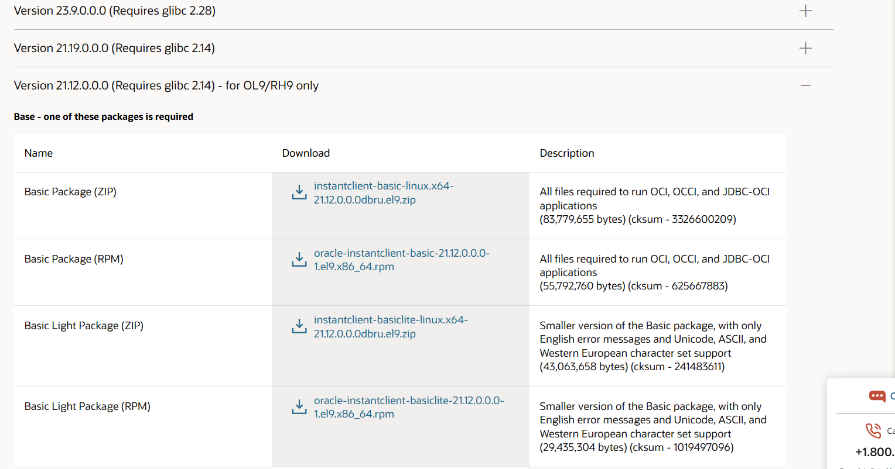

## Linux实战指令

### 0.开发中常用指令

#### 1.查询指定名称的RPM包(q：查询，a：所有的，-i：显示包的信息（如版本、安装时间、描述等），l：列出包安装的所有文件路径)
```shell
rpm -qa | grep -i python
```

#### 2.显示系统信息
```shell
uname -a
```

#### 3.显示系统版本信息
```shell
cat /etc/os-release
```

#### 4.显示系统版本信息
```shell
cat /etc/redhat-release
```

#### 5.查看处理器(cup)信息
```shell
lscpu

# 5.1在容器内部查看IP
hostname -I
# 5.2或者
ip addr show
```

#### 6.查看物理磁盘大小信息（SIZE 列显示磁盘或分区的总大小；TYPE 列标识设备类型（disk 表示物理磁盘，part 表示分区））
```shell
lsblk -o NAME,SIZE,TYPE,MOUNTPOINT
```

#### 7.直接显示磁盘的物理总容量，无需挂载即可查看（但还是使用lsblk好使）
```shell
fdisk -l | grep Disk
```

#### 8.查看系统启动时间
```shell
# 显示具体启动时间点
uptime  

# 显示系统启动时间（最简洁、直接）
who -b

cat /proc/uptime  

last reboot | head -1

last | grep reboot  

# 列出所有启动会话（能看到更多历史重启点）
journalctl --list-boots

# IDX BOOT ID                          FIRST ENTRY                 LAST ENTRY                 
#   0 f7ac3bf49caf462ca41fb97eaf5165b3 Tue 2026-06-02 00:39:26 +07 Tue 2026-06-02 13:34:57 +07
# 时间范围：这次启动是从 2026-06-02 00:39:26 开始，一直持续到你查询的时间 13:34:57（且仍在运行中，因为 IDX 是 0，代表当前会话）。

# 查看指定时间段内的重启日志
journalctl --since "2025-01-01" | grep "reboot"
```

#### 9.查看主机名
```shell
hostnamectl
```

#### 10.修改主机名
```shell
hostnamectl set-hostname your_hostname
```

#### 11.查看文件或文件夹的创建、访问(cat、less)、修改(vim、echo)、状态改变时间(元数据改变如权限、所有权、文件名)内容变动
```shell
# 访问时间
stat
ls -lu

# 修改时间
stat
ls -l

# 状态改变时间
stat
ls -lc

# 创建时间
stat # 依赖文件系统支持
```

#### 12.查看当前目录及子文件使用的总大小
```shell
du -sh .  # du 表示磁盘使用情况;-s 表示汇总;-h 表示以易读格式（如 KB、MB、GB）显示大小;. 表示当前目录
```

#### CSR文件生成
```shell
# 方式一：需要手动输入后面的值
openssl req -new -newkey rsa:2048 -nodes -keyout server.key -out server.csr

# 方式二：将要输入的值写入到配置文件中
[ req ]
default_bits       = 2048
distinguished_name = req_distinguished_name
req_extensions     = v3_req
prompt             = no

[ req_distinguished_name ]
C  = CN
ST = Beijing
L  = Beijing
O  = TTI
CN = cnsiotdp01.cn.globaltti.net

[ v3_req ]
subjectAltName = @alt_names

[ alt_names ]
IP.1 = 10.64.20.100
DNS.1 = cnsiotdp01.cn.globaltti.net

# 生成CSR文件
openssl req -newkey rsa:2048 -keyout cnsiotdp01.key -out cnsiotdp01.csr -config cnsiotdp01.cnf -nodes

# 生成PKCS12文件（按需执行，pkcs12用于Nifi中）
openssl pkcs12 -export -in vnsiotdp01.crt -inkey vnsiotdp01.key -out nifi.p12 -name "nifi-cert" -password pass:Y87XcfEfuW0
```


#### 13.开发查看端口
```shell
# 开放端口
sudo firewall-cmd --permanent --add-port=18083/tcp
sudo firewall-cmd --reload

# 关闭端口
sudo firewall-cmd --permanent --remove-port=18083/tcp
sudo firewall-cmd --reload

# 查看以开放的端口
sudo firewall-cmd --list-ports

# 查看当前运行时配置
sudo firewall-cmd --list-all

# 查看永久配置
sudo firewall-cmd --list-all --permanent

# 开放预定义服务（如果存在）
sudo firewall-cmd --permanent --add-service=https
sudo firewall-cmd --reload
```

#### 14.1.检查端口连通性
```shell
# netcat（网络猫）
telnet 127.0.0.1 1883
或
nc -vz 127.0.0.1 1883

-v: verbose模式，显示详细信息
-z: 扫描模式，只扫描端口而不发送数据
```

#### 14.2.查看所有监听端口(系统级别)
```shell
# socket statistics（套接字统计）
ss -tuln  # 比 netstat 更快更现代
ss -tuln | grep 18083 # 单独查询某个端口被监听情况
或
netstat -tuln
netstat -tuln | grep 18083  # 单独查询某个端口被监听情况

-t: 显示TCP套接字
-u: 显示UDP套接字
-l: 仅显示监听状态的套接字
-n: 不解析服务名称，直接显示端口号
```

#### 15.查询笔记本外部 IP(公网IP)
```shell
curl ipinfo.io/ip
或
curl ifconfig.me
```

#### 16.重启
```shell
sudo shutdown -r now
```

#### 17.关机
```shell
sudo shutdown -h now
```

#### 18.查找文件中的指定内容
```shell
# 1. 使用grep命令（推荐）
grep "id=57b665c1-7044-3320-3e03-d31a1ac33db4" a.txt

# 2. 如果需要显示行号
grep -n "id=57b665c1-7044-3320-3e03-d31a1ac33db4" a.txt

# 3. 如果需要显示匹配行的上下文
# 显示匹配行及前后各3行
grep -C 3 "id=57b665c1-7044-3320-3e03-d31a1ac33db4" a.txt

# 只显示匹配行及前3行
grep -B 3 "id=57b665c1-7044-3320-3e03-d31a1ac33db4" a.txt

# 只显示匹配行及后3行
grep -A 3 "id=57b665c1-7044-3320-3e03-d31a1ac33db4" a.txt

# 4. 如果需要忽略大小写
grep -i "id=57b665c1-7044-3320-3e03-d31a1ac33db4" a.txt

#5. 使用awk命令
awk '/id=57b665c1-7044-3320-3e03-d31a1ac33db4/ {print}' a.txt

#6. 如果文件很大，可以使用cat配合grep
cat a.txt | grep "id=57b665c1-7044-3320-3e03-d31a1ac33db4"

#最常用和推荐的是第一种方法，简单直接。如果需要更多上下文信息，可以使用带 -C、-B 或 -A 参数的grep命令。
```

#### 19.journalctl的使用
```shell
# 实时查看日志
sudo journalctl -u your_script.service -f  # 类似tail -f

# 查看服务执行的日志信息
journalctl -u nifi.service --since "2 day ago"

# 检查系统日志中的内存不足信息
sudo journalctl -k --since "2025-10-12 08:30:00" --until "2025-10-12 08:35:00" | grep -i "oom\|memory"

# 检查是否有进程被系统终止
sudo journalctl --since "2025-11-23 08:30:00" --until "2025-12-10 08:35:00" | grep -i "kill\|terminate"

# 查看 systemd 对该 unit 的完整 journal（包含 ExecStart stderr） -o：--output简写；cat：一种输出模式，提供简单日志条目视图，仅显示日志消息内容
sudo journalctl -u nifi.service --since "2025-12-07 22:24:00" --until "2025-12-07 22:26:00" -o cat

# 查看指定时间内的系统日志信息
journalctl --since "2025-11-23" --until "2025-12-07
```

#### 20.删除当前目录下除了a.txt和abc文件的所有文件
```shell
find . -mindepth 1 -maxdepth 1 \( ! -name "dist.zip" ! -name "dist_2" ! -name "dist.zip.2" \) -exec rm -rf {} +
```

#### 21.查看服务器重启情况
```shell
last reboot
```

#### 22.图形化界面切换
```shell
sudo systemctl set-default multi-user.target  # 切换到纯命令行模式
sudo reboot

sudo systemctl isolate multi-user.target  # 立即切换到命令行界面（会话保持）

sudo systemctl set-default graphical.target # 切换到图形界面模式
sudo reboot

sudo systemctl start graphical.target # 立即切换到图形界面
```

#### 23.统计当前目录下文件个数
```shell
# 递归统计当前目录及其子目录下所有普通文件个数
find . -type f | wc -l

# 若需包含隐藏文件，find 默认会包含（因为 . 包括隐藏目录）。如果不想递归子目录，加 -maxdepth 1
find . -maxdepth 1 -type f | wc -l
```

#### 24.切换wifi
```shell
# 如果WiFi隐藏
nmcli dev wifi connect "TTiDG-EM" password "123456" hidden yes

# 如果WiFi不隐藏
nmcli dev wifi connect "TTiDG-EM" password "123456"

# 如果显示NOT FOUND
# 第一步：打开WiFi
nmcli radio wifi on

# 第二步：重新扫描WiFi
nmcli dev wifi rescan

# 第三步：显示WiFi列表
nmcli dev wifi list 

# 第四步：连接WiFi
nmcli dev wifi connect "TTiDG-EM" password "123456"
```

#### 25.查看WiFi密码
```shell
sudo nmcli connection show "你的WiFi名称" --show-secrets | grep psk
```

#### 26.通过systemctl status查看服务不进行分页
```shell
sudo systemctl status docker --no-pager
# 在安装文档或脚本里常用 --no-pager，因为它更适合复制命令、记录日志、自动化执行，不会卡在分页界面等待你按 q
```

#### 27.新增用户给用户设置管理员权限
```shell
sudo adduser williamphan

# 确认是否有管理员权限
groups williamphan

# 设置管理员权限
sudo usermod -aG sudo williamphan

# 移除管理员权限
sudo deluser williamphan sudo
```

#### 28.手动同步系统时间（无网的情况下）
```shell
# 关闭自动时间同步
sudo timedatectl set-ntp false

# 手动设置时间
sudo timedatectl set-time "2026-08-31 13:13:07"

# 将当前系统时间写入RTC
sudo hwclock --systohc

# 查看时间是否生效
timedatectl
sudo hwclock --show
```

### 安装Oracle Instant Client

#### 1.创建目录
```shell
sudo mkdir /opt/oracle && cd /opt/oracle
```

#### 2.下载并解压Oracle Instant Client
```shell
sudo wget https://download.oracle.com/otn_software/linux/instantclient/instantclient-basic-linux.x64-19.3.0.0.0dbru.zip

# 如果地址不可用在Oracle官网查看
# https://www.oracle.com/database/technologies/instant-client/linux-x86-64-downloads.html
```


#### 3.解压文件
```shell
sudo unzip instantclient-basic-linux.x64-19.3.0.0.0dbru.zip
```

#### 4.设置环境变量
```shell
# 临时设置
export LD_LIBRARY_PATH=/opt/oracle/instantclient_19_3:$LD_LIBRARY_PATH

# 永久设置
echo 'export LD_LIBRARY_PATH=/opt/oracle/instantclient_19_3:$LD_LIBRARY_PATH' >> ~/.bashrc
source ~/.bashrc
```

#### 5.安装依赖
```shell
# Ubuntu/Debian
sudo apt-get update
sudo apt-get install libaio1

# CentOS/RHEL/Fedora
sudo yum install libaio
# 或者对于较新版本
sudo dnf install libaio

# Ubuntu/Debian
sudo apt-get update
sudo apt-get install libaio1

# CentOS/RHEL/Fedora
sudo yum install libaio
# 或者对于较新版本
sudo dnf install libaio # 推荐使用这个，dnf是最新的
```

#### 6.配置系统库路径
```shell
# 创建ldconfig配置文件
sudo vim /etc/ld.so.conf.d/oracle.conf

# 添加如下内容
/opt/oracle/instantclient_19_3

# 更新ldconfig缓存
sudo ldconfig
```

#### 7.检查是否完整安装
```shell
# 检查 libaio
ldconfig -p | grep libaio

# 检查 Oracle 客户端库
ls -la /opt/oracle/instantclient_19_3/libclntsh*
```
### 手动本地下载rpm

#### 清理并重建 yum 缓存
```shell
# 清理现有缓存
sudo yum clean all

# 重建缓存
sudo yum makecache

# 再次尝试下载
sudo yumdownloader libaio
```

#### 2.使用dnf替代yum（ehel8/9推荐）
```shell
# 清理缓存
sudo dnf clean all

# 更新缓存
sudo dnf makecache

# 下载 libaio
sudo dnf download libaio

# 下载开发包（可选）
sudo dnf download libaio-devel
```

### 本地安装rpm

#### 1.解决方案

#### 1.1.禁用订阅管理仓库，只使用本地 RPM 文件安装
```shell
sudo rpm -ivh libaio-*.rpm --nodeps

# 或者使用 --force 强制安装
sudo rpm -ivh --force libaio-*.rpm
```

#### 1.2.直接安装 RPM 包，跳过依赖检查
```shell
sudo rpm -ivh libaio-*.rpm --nodeps --force
```

#### 1.3.使用 dnf 进行本地安装（推荐使用）
```shell
sudo dnf install ./libaio-*.rpm --assumeyes
```

#### 1.4.临时配置本地仓库
```shell
# 创建本地仓库目录
sudo mkdir -p /tmp/localrepo

# 复制 RPM 文件到本地仓库
sudo cp libaio-*.rpm /tmp/localrepo/

# 创建仓库元数据
sudo createrepo /tmp/localrepo/

# 创建仓库配置文件
sudo tee /etc/yum.repos.d/local.repo << EOF
[local]
name=Local Repository
baseurl=file:///tmp/localrepo
enabled=1
gpgcheck=0
EOF
```

### 检查libaio rpm是否完整安装
```shell
ldconfig -p | grep libaio
```

### 注册Linux系统服务（基于systemd）

#### 1.将python脚本注册为Linux系统服务的详细步骤（基于systemd）

##### 1.1.新建service文件
```shell
sudo vim /etc/systemd/system/python_script.service
```

##### 1.2.编写服务配置（示例模板）
```
[Unit]
Description=My Python Service      # 服务描述
After=network.target               # 网络就绪后启动

[Service]
Type=simple
ExecStart=/usr/bin/python3 /绝对路径/your_script.py  # 必须用绝对路径
WorkingDirectory=/绝对路径/         # 脚本工作目录
Restart=always                     # 崩溃自动重启
User=your_username                 # 运行用户（建议非root）
Environment="PYTHONUNBUFFERED=1"   # 确保日志实时输出

[Install]
WantedBy=multi-user.target         # 多用户模式启动
```

```shell
# 3.重载systemd配置
sudo systemctl daemon-reload

# 4.启动服务和设置开机自启
sudo systemctl enable python_script.service
# 禁止服务自启
sudo systemctl disable python_script.service
# 启动服务
sudo systemctl start python_script.service

# 5.常用操作命令
# 查看状态
sudo systemctl status your_script.service  # 含运行日志

# 实时查看日志
sudo journalctl -u your_script.service -f  # 类似tail -f

# 重启/停止服务
sudo systemctl restart your_script.service
sudo systemctl stop your_script.service

# 6.其他service中的配置
# 1）：【日志重定向】若需将日志写入文件，在.service文件中添加
StandardOutput=file:/var/log/your_script.log
StandardError=file:/var/log/your_script_error.log

# 2）：【多进程设置】若脚本使用多进程（如 multiprocessing 库）
KillMode=process  # 防止systemd误杀子进程

# 3）：【资源限制】限制内存/CPU使用：
MemoryLimit=500M
CPUQuota=80%

```

### 生成自签名证书（https）
```shell
# 假设你的 IP 是 10.148.36.201

# 1.1 创建 OpenSSL 配置文件（如 nifi_cert.cnf）
[ req ]
default_bits       = 2048
distinguished_name = req_distinguished_name
req_extensions     = v3_req
prompt             = no

[ req_distinguished_name ]
C  = CN
ST = Test
L  = Test
O  = Test
CN = 10.148.36.201

[ v3_req ]
subjectAltName = @alt_names

[ alt_names ]
IP.1 = 10.148.36.201
DNS.1 = 10.148.36.201

# 1.2 生成私钥和证书(生成后会得到 nifi.key（私钥）和 nifi.crt（证书）)
openssl req -x509 -nodes -days 3650 -newkey rsa:2048 \
  -keyout nifi.key -out nifi.crt -config nifi_cert.cnf -extensions v3_req
  
# 1.3 生成 PKCS12 文件（NiFi 推荐）(会提示输入导出密码，记住这个密码)
openssl pkcs12 -export -in nifi.crt -inkey nifi.key -out nifi.p12 -name nifi-cert
```

### 下载jdk21rpm包、手动安装jdk21rpm包
```shell
# 1.创建安装目录
sudo mkdir -p /opt/java
sudo chown $(whoami):$(whoami) /opt/java
cd /opt/java

# 2.下载 Oracle JDK 21 RPM 包
wget https://download.oracle.com/java/21/latest/jdk-21_linux-x64_bin.rpm

# 3.验证下载完整性（可选）
sha256sum jdk-21_linux-x64_bin.rpm
# 对比输出与Oracle官网提供的SHA256校验值


# 4.1使用 yum 本地安装（会自动解决依赖关系）（网络问题情况下会出现：all mirrors were already tried without success）
sudo yum localinstall jdk-21_linux-x64_bin.rpm

# 4.2或者使用 rpm 命令安装(有一些还是使用这个rpm的方式好)
sudo rpm -ivh jdk-21_linux-x64_bin.rpm


# 5.检查安装的Java版本
java -version

# 6.检查JDK位置
which java
readlink -f $(which java)

# 7.列出安装的文件
rpm -ql jdk-21

# 8.在/etc/profile.d/下创建java.sh
sudo tee /etc/profile.d/java.sh <<'EOF'
export JAVA_HOME=$(dirname $(dirname $(readlink -f $(which java))))
export PATH=$JAVA_HOME/bin:$PATH
EOF

# 9.使配置生效
source /etc/profile.d/java.sh

# 10验证环境变量
echo $JAVA_HOME
echo $PATH

# 验证用户环境变量
cat ~/.bashrc

# 使用户的环境变量配置生效
source ~/.bashrc
```