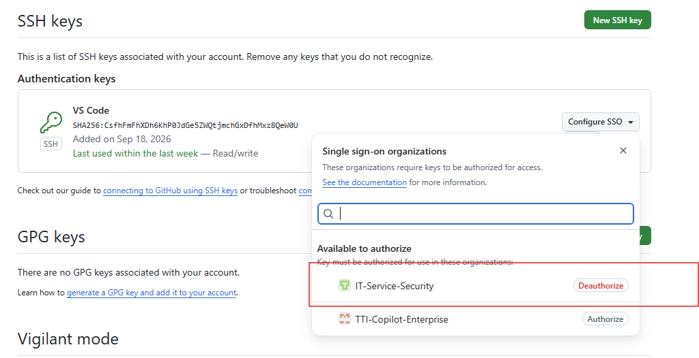

# Windows + VS Code 多 GitHub 账号 SSH 配置指南

> 适用场景：同一台 Windows 电脑和 VS Code 中同时使用企业 GitHub 账号与私人 GitHub 账号，并通过 SSH 自动选择对应账号，避免反复登录、凭据冲突及 `Permission denied (publickey)` 问题。

## 1. 方案目标

本指南使用两个独立的 SSH 密钥，并通过 SSH Host 别名明确区分账号：

```text
企业 GitHub 仓库  -> github-work     -> 企业 SSH Key
私人 GitHub 仓库  -> github-personal -> 私人 SSH Key
```

示例账号与组织：

```text
企业 GitHub 账号：Angelo-Luo_TTICoLtd
企业组织：IT-Service-Security
私人 GitHub 账号：angle-lzp
```

> 注意：VS Code 登录账号、GitHub Copilot 登录账号、Git SSH 认证账号和 Git Commit 作者信息是不同概念。采用本方案后，日常执行 `git pull`、`git fetch` 和 `git push` 时通常不需要在 VS Code 中来回退出和登录 GitHub 账号。

---

## 2. 前置检查

在 PowerShell 中执行：

```powershell
git --version
ssh -V
```

确认 Git 和 OpenSSH 均能正常使用。

查看用户主目录：

```powershell
$env:USERPROFILE
```

SSH 配置目录通常是：

```text
C:\Users\<Windows用户名>\.ssh
```

如目录不存在，可创建：

```powershell
New-Item -ItemType Directory -Force "$env:USERPROFILE\.ssh"
```

---

## 3. 创建企业 GitHub SSH 密钥

执行：

```powershell
ssh-keygen -t ed25519 -C "你的企业邮箱地址"
```

出现以下提示时：

```text
Enter file in which to save the key:
```

输入企业密钥的完整路径：

```text
C:\Users\<Windows用户名>\.ssh\id_ed25519_github_work
```

也可以直接执行：

```powershell
ssh-keygen -t ed25519 -C "你的企业邮箱地址" -f "$env:USERPROFILE\.ssh\id_ed25519_github_work"
```

系统随后询问是否设置 Passphrase：

```text
Enter passphrase (empty for no passphrase):
```

建议为私钥设置密码，以降低私钥文件泄露后的风险。若设置了密码，可通过 Windows OpenSSH Agent 缓存解锁状态。

创建完成后会生成：

```text
id_ed25519_github_work      # 企业私钥，禁止上传、分享或提交到 Git
id_ed25519_github_work.pub  # 企业公钥，可添加到企业 GitHub 账号
```

---

## 4. 创建私人 GitHub SSH 密钥

执行：

```powershell
ssh-keygen -t ed25519 -C "你的私人邮箱地址" -f "$env:USERPROFILE\.ssh\id_ed25519_github_personal"
```

创建完成后会生成：

```text
id_ed25519_github_personal      # 私人私钥，禁止上传、分享或提交到 Git
id_ed25519_github_personal.pub  # 私人公钥，可添加到私人 GitHub 账号
```

最终 `.ssh` 目录主要包含：

```text
.ssh\
├── config
├── id_ed25519_github_work
├── id_ed25519_github_work.pub
├── id_ed25519_github_personal
├── id_ed25519_github_personal.pub
└── known_hosts
```

---

## 5. 将企业公钥添加到企业 GitHub 账号

在 PowerShell 中显示并复制企业公钥：

```powershell
Get-Content "$env:USERPROFILE\.ssh\id_ed25519_github_work.pub"
```

也可直接复制到剪贴板：

```powershell
Get-Content "$env:USERPROFILE\.ssh\id_ed25519_github_work.pub" | Set-Clipboard
```

然后使用企业 GitHub 账号登录 GitHub，依次进入：

```text
头像
-> Settings
-> SSH and GPG keys
-> New SSH key
```

填写建议：

```text
Title：Windows-VSCode-Work
Key type：Authentication Key
Key：粘贴 id_ed25519_github_work.pub 的完整内容
```

点击 **Add SSH key** 保存。



> 如果企业组织启用了 SAML SSO，添加 SSH Key 后可能还需要在该 Key 的配置位置执行组织授权，没有给组织授权代码无法提交。是否需要取决于企业 GitHub 组织的安全策略。

---

## 6. 将私人公钥添加到私人 GitHub 账号

显示并复制私人公钥：

```powershell
Get-Content "$env:USERPROFILE\.ssh\id_ed25519_github_personal.pub" | Set-Clipboard
```

使用私人 GitHub 账号登录 GitHub，进入：

```text
头像
-> Settings
-> SSH and GPG keys
-> New SSH key
```

填写建议：

```text
Title：Windows-VSCode-Personal
Key type：Authentication Key
Key：粘贴 id_ed25519_github_personal.pub 的完整内容
```

点击 **Add SSH key** 保存。

> 同一把 SSH 公钥通常不应同时绑定到两个不同 GitHub 账号。企业和私人账号应分别使用不同的密钥对。

---

## 7. 配置 SSH Host 别名

打开或创建配置文件：

```powershell
notepad "$env:USERPROFILE\.ssh\config"
```

写入以下内容：

```sshconfig
# ==================================================
# 企业 GitHub
# Host 是本机使用的别名，并不是真实网站域名。
# 当 Remote 使用 github-work 时，SSH 将连接 github.com，
# 同时强制使用企业账号对应的私钥。
# ==================================================
Host github-work
    HostName github.com
    User git
    IdentityFile ~/.ssh/id_ed25519_github_work
    IdentitiesOnly yes

# ==================================================
# 私人 GitHub
# 当 Remote 使用 github-personal 时，SSH 将连接 github.com，
# 同时强制使用私人账号对应的私钥。
# ==================================================
Host github-personal
    HostName github.com
    User git
    IdentityFile ~/.ssh/id_ed25519_github_personal
    IdentitiesOnly yes
```

关键参数说明：

- `Host`：本地别名，用于仓库 Remote 地址，例如 `github-work`。
- `HostName`：真实 SSH 服务器地址，两个账号都连接 `github.com`。
- `User git`：GitHub SSH 固定使用 `git` 用户，不要改成 GitHub 用户名。
- `IdentityFile`：指定该别名必须使用的私钥。
- `IdentitiesOnly yes`：只使用指定的密钥，避免 SSH Agent 中其他密钥干扰认证。

> Windows 必须确保文件名确实是 `config`，而不是 `config.txt`。可在资源管理器中开启“文件扩展名”显示后检查。

查看最终配置：

```powershell
Get-Content "$env:USERPROFILE\.ssh\config"
```

---

## 8. 首次验证 SSH 连接

### 8.1 验证企业 GitHub 账号

```powershell
ssh -T github-work
```

成功时会显示类似：

```text
Hi Angelo-Luo_TTICoLtd! You've successfully authenticated, but GitHub does not provide shell access.
```

这表示企业 SSH Key 已被 GitHub 正确识别。

### 8.2 验证私人 GitHub 账号

```powershell
ssh -T github-personal
```

成功时会显示类似：

```text
Hi angle-lzp! You've successfully authenticated, but GitHub does not provide shell access.
```

这表示私人 SSH Key 已被 GitHub 正确识别。

### 8.3 首次连接的主机指纹提示

第一次连接 GitHub 时可能显示：

```text
The authenticity of host 'github.com (...)' can't be established.
Are you sure you want to continue connecting (yes/no/[fingerprint])?
```

应先核对 GitHub 官方公布的 SSH 主机指纹。确认一致后输入：

```text
yes
```

确认后，主机信息会写入：

```text
C:\Users\<Windows用户名>\.ssh\known_hosts
```

---

## 9. 为企业仓库配置 Remote

先进入企业仓库，例如：

```powershell
cd C:\IOT\Project\IoT-AI-Project\iot-yolo-training
```

查看当前 Remote：

```powershell
git remote -v
```

企业仓库必须使用 `github-work` 别名：

```powershell
git remote set-url origin git@github-work:IT-Service-Security/iot-yolo-training.git
```

再次检查：

```powershell
git remote -v
```

正确结果应类似：

```text
origin  git@github-work:IT-Service-Security/iot-yolo-training.git (fetch)
origin  git@github-work:IT-Service-Security/iot-yolo-training.git (push)
```

测试：

```powershell
git fetch
git pull
git push
```

> `IT-Service-Security` 是组织名，`iot-yolo-training` 是仓库名。其他企业仓库按实际组织名和仓库名替换。

---

## 10. 为私人仓库配置 Remote

进入私人仓库，例如：

```powershell
cd C:\apps\androidFramework\GitApplication
```

检查当前 Remote：

```powershell
git remote -v
```

私人仓库必须使用 `github-personal` 别名：

```powershell
git remote set-url origin git@github-personal:angle-lzp/Java-Deep-Base.git
```

再次检查：

```powershell
git remote -v
```

正确结果应类似：

```text
origin  git@github-personal:angle-lzp/Java-Deep-Base.git (fetch)
origin  git@github-personal:angle-lzp/Java-Deep-Base.git (push)
```

测试：

```powershell
git fetch
git pull
git push
```

---

## 11. 为什么不能全部使用 `git@github.com`

以下两个地址虽然都指向 GitHub，但没有明确指定不同账号的密钥：

```text
git@github.com:IT-Service-Security/iot-yolo-training.git
git@github.com:angle-lzp/Java-Deep-Base.git
```

当 SSH 连接统一使用 `github.com` 时，SSH 可能优先选择默认密钥或 SSH Agent 中先加载的密钥。例如，若优先使用企业 Key：

```text
企业仓库 -> 企业 Key -> 有权限 -> 操作成功
私人仓库 -> 企业 Key -> 无权限 -> 操作失败
```

常见错误为：

```text
git@github.com: Permission denied (publickey).
fatal: Could not read from remote repository.
```

使用 Host 别名以后：

```text
git@github-work:...     -> 强制使用企业 Key
git@github-personal:... -> 强制使用私人 Key
```

因此两个账号可以同时使用，不需要手动切换默认 SSH Key。

---

## 12. 新 Clone 仓库时的正确写法

### 企业仓库

```powershell
git clone git@github-work:IT-Service-Security/仓库名.git
```

示例：

```powershell
git clone git@github-work:IT-Service-Security/iot-yolo-training.git
```

### 私人仓库

```powershell
git clone git@github-personal:angle-lzp/仓库名.git
```

示例：

```powershell
git clone git@github-personal:angle-lzp/Java-Deep-Base.git
```

> 从 GitHub 网页复制的 SSH 地址默认通常是 `git@github.com:...`。在多账号环境中，复制后应手动将 `github.com` 替换为 `github-work` 或 `github-personal`。

---

## 13. 分别配置 Commit 作者信息

SSH Key 决定“使用哪个 GitHub 账号认证”，而 `user.name` 和 `user.email` 决定“Commit 中记录的作者”。两者需要分别配置。

### 13.1 企业仓库

在企业仓库目录中执行：

```powershell
git config --local user.name "Angelo Luo"
git config --local user.email "你的企业 GitHub 邮箱"
```

### 13.2 私人仓库

在私人仓库目录中执行：

```powershell
git config --local user.name "angle-lzp"
git config --local user.email "你的私人 GitHub 邮箱"
```

检查当前仓库最终生效的配置：

```powershell
git config --local --list
git config --show-origin --get user.name
git config --show-origin --get user.email
```

> 为保护真实邮箱，也可以使用对应 GitHub 账号提供的 `noreply` 邮箱。无论使用哪种邮箱，都应确保该邮箱已添加到对应 GitHub 账号，否则 Commit 可能无法正确关联到账号。

---

## 14. 可选：按项目父目录自动切换 Commit 身份

如果企业项目统一放在：

```text
C:\IOT\Project\IoT-AI-Project\
```

私人项目统一放在：

```text
C:\apps\
```

可以使用 Git 的 `includeIf` 自动套用作者信息。

编辑全局配置：

```powershell
git config --global --edit
```

添加：

```gitconfig
[includeIf "gitdir:C:/IOT/Project/IoT-AI-Project/"]
    path = ~/.gitconfig-work

[includeIf "gitdir:C:/apps/"]
    path = ~/.gitconfig-personal
```

创建企业配置文件：

```powershell
notepad "$env:USERPROFILE\.gitconfig-work"
```

内容：

```gitconfig
[user]
    name = Angelo Luo
    email = 你的企业 GitHub 邮箱
```

创建私人配置文件：

```powershell
notepad "$env:USERPROFILE\.gitconfig-personal"
```

内容：

```gitconfig
[user]
    name = angle-lzp
    email = 你的私人 GitHub 邮箱
```

在不同仓库中检查实际生效来源：

```powershell
git config --show-origin --get user.name
git config --show-origin --get user.email
```

> `includeIf` 只负责切换 Commit 作者信息。SSH 账号仍由 Remote 中的 `github-work` 或 `github-personal` 决定。

---

## 15. VS Code 中如何切换 Git 账号

采用 SSH Host 别名后，Git 操作通常不需要在 VS Code 中手动切换账号：

```text
VS Code 当前登录账号
    -> 主要供 Settings Sync、GitHub 扩展、GitHub Copilot 等功能使用

Git pull / fetch / push 使用的账号
    -> 由仓库 Remote 中的 github-work 或 github-personal 决定

Commit 显示的作者
    -> 由当前仓库的 user.name 和 user.email 决定
```

因此可以让 VS Code 和 GitHub Copilot长期保持企业账号登录，同时让私人仓库通过 `github-personal` SSH Key 正常 Pull/Push。

如需隔离扩展、设置、Copilot 或 GitHub Pull Requests 登录状态，可创建两个 VS Code Profile：

```text
Work Profile
Personal Profile
```

在命令面板中执行：

```text
Profiles: Create Profile
Profiles: Switch Profile
```

但这不是 Git SSH 多账号正常工作的必要条件。

---

## 16. Windows SSH Agent 配置（可选）

如果私钥设置了 Passphrase，可使用 Windows OpenSSH Authentication Agent 减少重复输入。

以管理员身份打开 PowerShell：

```powershell
Get-Service ssh-agent
Set-Service -Name ssh-agent -StartupType Automatic
Start-Service ssh-agent
```

添加企业和私人密钥：

```powershell
ssh-add "$env:USERPROFILE\.ssh\id_ed25519_github_work"
ssh-add "$env:USERPROFILE\.ssh\id_ed25519_github_personal"
```

查看已经加载的密钥：

```powershell
ssh-add -l
```

由于 `config` 中已经设置：

```text
IdentitiesOnly yes
```

即使 Agent 同时加载多个密钥，也会按 Host 别名使用指定密钥。

---

## 17. HTTPS 凭据与 Windows Credential Manager

SSH 模式下，Git 的 Pull/Push 不依赖以下 HTTPS 凭据：

```text
git:https://github.com
git:https://10.x.x.x
```

如果以前使用过 HTTPS，并遇到反复登录，可在 Windows 中进入：

```text
控制面板
-> 用户账户
-> 凭据管理器
-> Windows 凭据
```

只删除已经确认不再使用或已经失效的 Git HTTPS 凭据。

> 不建议在不了解用途的情况下删除所有 VS Code、GitHub、GitLab 或企业凭据。VS Code 扩展、GitHub Copilot 和 Git 命令行可能使用不同的认证会话。

---

## 18. 常见问题排查

### 18.1 `Permission denied (publickey)`

先测试对应别名：

```powershell
ssh -T github-work
ssh -T github-personal
```

然后检查 Remote：

```powershell
git remote -v
```

企业仓库应包含：

```text
git@github-work:
```

私人仓库应包含：

```text
git@github-personal:
```

若仍为：

```text
git@github.com:
```

则仓库没有使用多账号别名。

### 18.2 测试别名成功，但 `git push` 失败

典型原因是测试使用了：

```powershell
ssh -T github-personal
```

但 Remote 仍然使用：

```text
git@github.com:angle-lzp/仓库名.git
```

修复：

```powershell
git remote set-url origin git@github-personal:angle-lzp/仓库名.git
```

### 18.3 Remote 仓库名配置错误

检查：

```powershell
git remote -v
git remote show origin
```

确认当前本地目录对应正确的组织、用户名和仓库名，避免将 `iot-db` 错误指向 `iot-yolo-training` 等其他仓库。

### 18.4 查看 SSH 实际使用了哪把密钥

企业账号详细诊断：

```powershell
ssh -vT github-work
```

私人账号详细诊断：

```powershell
ssh -vT github-personal
```

重点查看带有以下内容的行：

```text
Offering public key
identity file
Authenticated to github.com
```

### 18.5 检查 SSH 配置解析结果

```powershell
ssh -G github-work | Select-String "hostname|user|identityfile|identitiesonly"
ssh -G github-personal | Select-String "hostname|user|identityfile|identitiesonly"
```

这可以确认别名被解析到哪个服务器和私钥。

### 18.6 检查 Remote 使用的 SSH 命令

```powershell
$env:GIT_SSH_COMMAND = "ssh -v"
git fetch
Remove-Item Env:GIT_SSH_COMMAND
```

该方式可查看 Git Fetch 过程中 SSH 的详细认证日志。

---

## 19. 日常操作示例

### 企业项目

```powershell
cd C:\IOT\Project\IoT-AI-Project\iot-yolo-training
git remote -v
git pull
git add .
git commit -m "更新企业项目"
git push
```

Remote 应为：

```text
git@github-work:IT-Service-Security/iot-yolo-training.git
```

### 私人项目

```powershell
cd C:\apps\androidFramework\GitApplication
git remote -v
git pull
git add .
git commit -m "更新私人项目"
git push
```

Remote 应为：

```text
git@github-personal:angle-lzp/Java-Deep-Base.git
```

---

## 20. 最终检查清单

- [ ] 已创建企业 SSH Key：`id_ed25519_github_work`
- [ ] 已创建私人 SSH Key：`id_ed25519_github_personal`
- [ ] 企业公钥已添加到企业 GitHub 账号
- [ ] 私人公钥已添加到私人 GitHub 账号
- [ ] `.ssh/config` 中已配置 `github-work`
- [ ] `.ssh/config` 中已配置 `github-personal`
- [ ] 两个 Host 均已设置 `IdentitiesOnly yes`
- [ ] `ssh -T github-work` 返回企业 GitHub 用户名
- [ ] `ssh -T github-personal` 返回私人 GitHub 用户名
- [ ] 企业 Remote 使用 `git@github-work:`
- [ ] 私人 Remote 使用 `git@github-personal:`
- [ ] 企业仓库已设置正确的 Commit 邮箱
- [ ] 私人仓库已设置正确的 Commit 邮箱
- [ ] Git Pull、Fetch、Push 均已测试成功

---

## 21. 核心结论

多 GitHub 账号环境中，不建议让企业仓库和私人仓库都使用相同的：

```text
git@github.com:
```

推荐固定使用：

```text
企业 GitHub：git@github-work:组织名/仓库名.git
私人 GitHub：git@github-personal:用户名/仓库名.git
```

SSH Host 别名负责选择密钥，仓库级或 `includeIf` 配置负责选择 Commit 作者。完成配置后，VS Code 不需要为了 Git Pull/Push 在企业 GitHub 与私人 GitHub 之间反复退出和登录。
